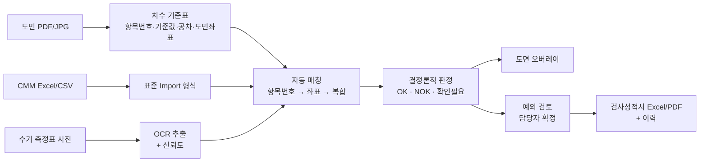
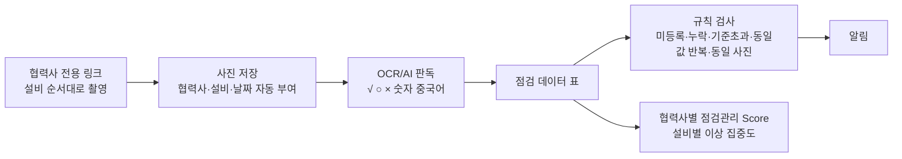
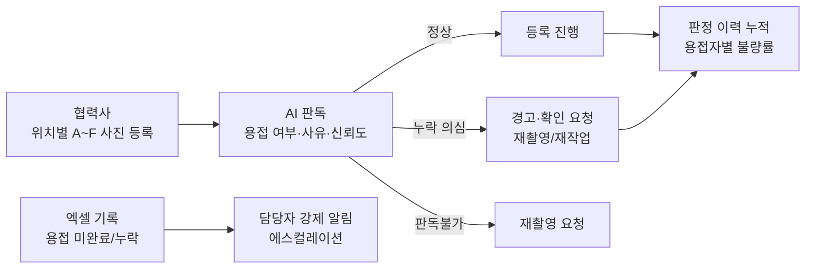

# 초도품 치수검사 자동화 · 협력사 일일점검표 사진 품질관리 · 용접누락 검출 — 프로젝트 기획서

| 항목 | 내용 |
|---|---|
| 리포 | data09-08 |
| 제출자 | 김무연 |
| 직무·소속 | 인천캠퍼스 제품품질팀 (과제 A·B) / 인천캠퍼스 부품품질팀 (과제 C, 게시물 3에 적힌 소속) |
| 과정 | 현장 데이터 디지털화 전문가과정 1차수 |
| 작성일 | 2026-09-28 |
| 문서 상태 | 초안 v0.2 — 수강생 추가 게시물·댓글 반영 |

> 제출자는 서로 다른 과제 3건을 올렸습니다(2026-09-28에 세 번째 과제 추가). 이 문서는 세 과제를 **과제 A**, **과제 B**, **과제 C**로 나누어 한 문서에 정리합니다.
>
> - **과제 A — AI 기반 초도품 치수검사 자동화 시스템** (게시물 1, 첨부 01)
> - **과제 B — 협력사 설비 일일점검표 사진 기반 품질관리 시스템** (게시물 2, 첨부 02)
> - **과제 C — 용접누락 방지 검출 시스템** (게시물 3, 첨부 03, 2026-09-28 추가)
>
> **1차 개발 대상은 과제 A입니다.** 이유는 세 가지입니다.
> 1. 최종 OK/NOK 판정을 "기준값·공차·측정값으로 계산하는 결정론적 로직"으로 하겠다고 제출자가 이미 정했습니다. 이 핵심은 AI 인식 정확도와 상관없이 지금 바로 만들 수 있습니다.
> 2. 입력(도면·CMM 결과·수기 측정표)이 제품품질팀 안에서 확보됩니다. 과제 B는 중국 협력사의 접속 환경·플랫폼 선정·중국어 손글씨 OCR 검증이 먼저 풀려야 해서 선행 조건이 많습니다.
> 3. 과제 A에서 만드는 "사진 → 숫자 추출 → 확인필요 표시 → 사람이 확정" 흐름을 과제 B가 그대로 재사용할 수 있습니다.
>
> 과제 C는 추가 게시물에서 1차 개발 대상을 바꾸자는 요청이 없어 **1차 개발 대상은 그대로 과제 A**로 둡니다. 과제 C는 사진 판독(AI)이 핵심이라 정상/누락 라벨이 붙은 사진 세트가 먼저 있어야 하므로, 이 문서에서는 1단계 시제품에 무엇이 필요한지까지만 정리합니다.

---

## 1. 추진 배경과 현안

### 과제 A — 초도품 치수검사

- 초도품 제작 후 도면의 전체 치수를 기준으로 CMM(3차원 측정기)과 작업자 수기 측정을 함께 합니다.
- 측정항목이 많아 측정결과와 도면 치수를 하나하나 대조하는 데 시간이 많이 걸립니다.
- 제출자가 정리한 현행 문제는 다음과 같습니다.

| 현행 문제 | 내용 |
|---|---|
| 도면 대조 | 도면의 수많은 치수 중 해당 측정값이 어느 치수인지 수작업 확인 |
| CMM 결과 | Excel/CSV 결과와 도면 항목을 수동으로 연결 |
| 수기 측정 | 종이 검사표의 값을 다시 읽고 분류·입력 |
| 판정 | 기준값/상·하한 공차를 사람이 계산하여 OK/NOK 확인 |
| 불량 위치 확인 | NOK 항목을 다시 도면에서 찾아야 함 |
| 중국 현장 | 한국과 중국의 언어·양식 차이로 데이터 통합이 어려움 |

- 제출자는 "가장 중요한 기술요소는 단순 숫자 OCR이 아니라 측정값이 도면의 어느 치수인지를 연결하는 것"이라고 짚었습니다.

### 과제 B — 협력사 설비 일일점검표

- 협력사가 설비별 일일점검을 하지만 점검표 대부분이 수기로 작성되어 본사가 점검 활동을 체계적으로 확인하기 어렵습니다.
- 점검표 작성 미비·관리 부족이 설비 관리 부족으로 이어져 하자가 발생합니다.
- 제출자가 든 관리상의 한계는 다음과 같습니다.
  - 협력사별 점검표 양식이 서로 다름
  - 수기 작성이라 데이터화가 어려움
  - 제출 여부를 일일이 확인해야 함
  - 미작성·누락을 빨리 파악하기 어려움
  - 측정값 추세·이상을 체계적으로 분석하기 어려움
  - 실제로 점검했는지 사후 검증이 어려움
- 이상점(동일 사진, 기입불량, 치수 불량)이 생기면 알림을 받고 싶어 합니다.

### 과제 C — 용접누락 방지 검출 (2026-09-28 추가)

- 대상 공정은 Boom/Arm 내부용접이고, 대상 협력사는 엑셀 검사성적서를 제출하는 협력사 전체입니다(첨부 03 표제 표).
- 협력사는 용접 사진을 가이드에 맞게 찍어 엑셀 검사성적서에 등록하고, 회사 포털에서 업로드 권한을 받아 파일을 올립니다.
- 용접이 되지 않은 제품의 사진이 올라왔지만 걸러지지 않았고, 그 제품이 조립되어 고객 사용 중 깨지는 하자가 발생했습니다.
- 제출자가 정리한 검출 실패 지점은 두 곳입니다.
  - 협력사의 내부용접 사진 촬영 시 미검출
  - 사진 등록 및 본사 검토 시 미검출
- 근본 원인은 "불량 정보가 이미 있었는데 확인하고 걸러내는 절차가 없었던 프로세스 단절"로 적었습니다. 협력사가 낸 엑셀 검사성적서에서도 용접이 안 된 상태가 이미 확인되는 건이었습니다.
- 경영진으로부터 재발방지 장치 마련과 "협력사 업로드 시점 AI 용접누락 감지 가능 여부 검토"가 요청되었습니다.
- 게시물 3에는 "해당 용접자의 불량률도 누적하여 확인"하고 싶다는 요구가 추가로 적혀 있습니다.

## 2. 목표

### 최종 목표

- **과제 A**: 도면을 기준으로 CMM 측정값과 작업자 수기 측정값을 하나의 검사 데이터로 묶고, 자동 판정과 도면 위 불량 위치 표시를 제공하는 품질검사 웹 시스템. 한국·중국 공장이 같은 시스템을 씁니다. 사람은 AI가 판단하기 어려운 항목과 예외만 확인합니다.
- **과제 B**: 협력사의 행동은 "매일 점검표를 작성하고 사진으로 등록한다"로 단순화하고, 본사는 사진을 바탕으로 "제대로 점검했는가 → 이상은 없는가 → 이상 징후가 늘고 있는가 → 실제 품질문제와 연결되는가"를 데이터로 관리합니다.

- **과제 C**: 협력사가 검사성적서 엑셀을 작성·업로드하는 시점에 첨부 사진을 판독해 용접누락을 바로 감지하고, 미용접 제품이 본사 입고·조립 공정으로 넘어가지 않게 합니다. 판독 결과는 협력사·본사 담당자에게 공유하고, 용접자별 불량률을 누적합니다. 제출자는 AI 판독을 "보완적 안전망"으로 두고, 엑셀에 "용접 미완료/누락"으로 기록된 항목의 강제 알림·조립 투입 전 확인 체크포인트를 함께 두겠다고 적었습니다.

### 1차 개발 목표 (과제 A)

- 도면 치수 기준표(항목번호·기준값·공차)와 CMM 측정결과(Excel/CSV)를 올리면 **항목번호로 매칭해 OK / NOK / 확인필요를 자동 판정**합니다.
- 도면 이미지 위에 치수 항목 위치를 찍어 두면, 판정 결과를 **녹색(OK) / 빨간색(NOK) / 노란색(확인필요)** 으로 겹쳐 보여 줍니다.
- 결과를 검사성적서 형태의 Excel로 내려받습니다.
- 도면 치수 자동 인식(OCR)과 손글씨 측정표 인식은 2단계 이후로 둡니다.

## 3. 보유 데이터

> 실제 샘플 파일은 아직 받지 않았습니다. 아래는 제출 문서에 적힌 데이터 종류와 제출자가 PoC용으로 준비하겠다고 적은 자료입니다.

| 데이터 | 형태 | 규모·주기 | 비고(민감도 등) |
|---|---|---|---|
| [A] 초도품 도면 | PDF 또는 고해상도 이미지(JPG) | PoC용 1~3종 (첨부 01 §14) | 사내 도면 — 기밀. 해외(중국) 전송 여부는 회사 보안정책 검토 대상이라고 제출자가 명시 |
| [A] CMM 측정결과 | Excel/CSV (장비 출력) | 도면과 같은 품번 | 컬럼 구조 미확인. 제출 문서상 포함 정보: 측정값·측정번호·단위·항목명 |
| [A] 수기 측정표 | 종이 검사표 사진(휴대폰·PC 촬영) | 도면과 같은 품번 | 인쇄문자 + 손글씨 혼합. 중국 현장은 중국어 문구와 숫자 혼합 |
| [A] 검사성적서 양식 | 현재 사용 양식 | 1종 이상 | 출력 형식의 기준 |
| [A] 품번/Rev·공차 표기 규칙 | 문서 | — | 단측공차·± 공차·소수점 자리수 규칙 |
| [A] 과거 검사 사례 | 정상/불량이 확인된 기록 | "가능하다면" | 판정 로직 검증용 |
| [B] 협력사 일일점검표 사진 | 휴대폰 촬영 사진 | 매일, 협력사×설비 수만큼 | 양식이 협력사마다 다름. 중국어 수기 포함. 작업자 이름이 적혀 있어 개인정보 관리 기준 필요 |
| [B] 추출 목표 데이터 | 표(협력사·점검일·설비·점검항목·판정·측정값·원본사진) | 제출 문서의 예시 구조 | 예시 값(A사 1호기 압력 18.2 등)은 설명용 예시로 보임 (가정) |
| [C] 용접 사진(양호/불량) | 위치별(A~F) 내부용접 사진, 엑셀 검사성적서에 등록된 형태 | 수량 미확인 | 제출자가 실제 제출 사진을 검토해 보니 위치에 따라 어둡거나 초점이 맞지 않은 사진이 다수라고 적음. 사고가 난 B·E 위치 샘플을 우선 확보할 계획 |
| [C] 협력사 내부용접 검사성적서 | 엑셀(사진 + 기록) | 제출 건마다 | 시트 구조 미확인. "용접 미완료/누락" 기록 칸이 있는 것으로 보임 (가정) |
| [C] 정상/누락 라벨 | 사람이 확인한 판정을 파일명 또는 표에 기록 (예: B위치-정상, E위치-누락) | 확보 예정 (첨부 03 §4.2) | 판독불가 동작 검증용 경계 사례(그을음·어두운 정상 사진)도 포함 예정 |
| [C] 용접자 정보 | 사진·성적서에 연결된 용접자 | 미확인 | 게시물 3의 "용접자 불량률" 요구에 필요. 현재 성적서에 용접자 칸이 있는지 확인 필요. 개인정보 관리 기준 대상 |

## 4. 해결 방안 개요

### 과제 A

제출자가 정리한 업무 흐름: ① 품번/Rev 등록 → ② 도면 업로드 → ③ AI 치수 추출 및 번호화 → ④ CMM 결과 업로드 → ⑤ 수기 측정표 촬영 업로드 → ⑥ AI/OCR 항목 분류 → ⑦ 자동 매칭 → ⑧ 공차 자동판정 → ⑨ 도면 NOK 표시 → ⑩ 품질담당자 예외 검토 → ⑪ 검사성적서 확정 → ⑫ 이력 저장

제출자가 정한 매칭 단계:

| 매칭 수준 | 방법 | 활용 |
|---|---|---|
| 1단계 | 항목번호/명칭 직접 매칭 | 표준화된 검사표에 적합 |
| 2단계 | 도면 좌표·치수 텍스트 위치 매칭 | 도면 자동 분석 |
| 3단계 | CMM 항목 및 특징정보 매칭 | CMM 데이터 연계 |
| 4단계 | AI 복합 매칭 + 신뢰도 | 모호한 항목의 후보 비교 |
| 예외 | 사용자 확인 | 불확실한 항목을 강제 판정하지 않음 |

1차 개발은 **1단계(항목번호 직접 매칭)** 만 구현합니다.

### 과제 B

- 협력사: 설비 점검 → 기존과 같이 수기 점검표 작성 → 휴대폰으로 등록 링크 접속 → 설비 순서대로 사진 업로드 → 제출
- 본사: 사진 자동 수집 → AI/OCR 판독 → 협력사·설비·날짜 자동 분류 → 체크·숫자 데이터화 → 누락·이상 자동 검출 → 협력사별·설비별 분석 → 알림

### 과제 C

제출자가 정한 판별 흐름(첨부 03 §3.2):

| 단계 | 구분 | 내용 |
|---|---|---|
| 1 | 사진 등록 | 협력사가 위치별(A~F) 내부용접 사진을 엑셀 검사성적서에 등록 |
| 2 | AI 판독 | 위치별 사진을 판독해 결과 반환(용접 여부 / 판정 사유 / 신뢰도) |
| 3 | 판정 처리 | 정상 → 등록 진행 / 누락 의심 → 경고 및 확인 요청(재촬영·재작업) / 판독불가 → 재촬영 요청(OK/NG를 억지로 판단하지 않음) |
| 4 | 결과 공유 | 판정 결과를 협력사·본사 담당자에게 메일로 공유 |
| 5 | 이력 관리 | 판정 결과와 사진 이력을 누적해 모델 개선·추적에 활용 |

- 판별 범위는 단계적으로 넓힙니다: 1단계 용접 여부(누락) 판별(비드 유무 이진 판단) → 후속 용접 품질(언더컷·기공) → 개선포인트 제시. 각장(z') 정량 측정은 범위 밖이며 기존처럼 검사원이 실측해 기입합니다.
- 구현 방식은 엑셀 매크로 내장을 유력 대안으로 두고, 기존 업로드 사이트 연동·별도 업로드 페이지와 비교해 관련 부서 협의 후 확정한다고 적었습니다. 보안팀은 문제가 없는 범위에서 사내 에이전트를 사용해 개발하도록 안내했다고 합니다.

## 5. 주요 기능

### 과제 A

| 기능 | 설명 | 우선순위 |
|---|---|---|
| 검사 건 등록 | 품번·Rev·LOT·검사일·업체·검사자 입력 | MVP |
| 치수 기준표 입력 | 도면 치수를 표로 입력(항목번호·치수 종류·기준값·상/하 공차·단위). Excel 붙여넣기 지원 | MVP |
| CMM 결과 가져오기 | Excel/CSV 업로드 → 컬럼 지정(측정번호·항목명·측정값·단위) → 표준 형식 변환. 장비별 매핑 템플릿 저장 | MVP |
| 자동 판정 | 기준치와 공차로 상·하한 계산, 측정값 판정. ± 공차·단측공차·단위 변환·소수점 자리수를 규칙으로 관리 | MVP |
| 확인필요 분류 | 매칭 실패·값 누락·단위 불일치는 판정하지 않고 "확인필요"로 표시 | MVP |
| 도면 오버레이 | 도면 이미지 위에 항목 위치를 클릭해 핀 등록 → 판정 색(녹/적/황) 표시, 핀 클릭 시 기준값·공차·측정값·편차 표시 | MVP |
| 통합 검사결과 표 | 전체 치수별 기준/측정/공차/편차/판정 | MVP |
| 검사성적서 출력 | 결과를 Excel로 내보내기 (현재 양식에 맞춤) | MVP |
| 수기 측정표 OCR | 사진에서 항목번호·숫자 추출, 신뢰도 저장, 원본 사진과 대조 후 확정 | 확장 |
| 도면 치수 자동 인식 | 선형치수·직경/반경·각도·깊이·위치치수 추출 + 도면 좌표. 이후 GD&T로 확대 | 확장 |
| 좌표·복합 매칭 | 매칭 2~4단계 | 확장 |
| 예외 검토 화면 | 신뢰도 낮은 항목 승인/수정, 수정 이력(누가·언제·무엇) | 확장 |
| 대시보드·이력 검색 | 검사 건수, OK/NOK/확인필요, 품번·Rev·업체·LOT별 조회 | 확장 |
| 한·중·영 다국어 UI, 권한 | 본사/중국법인/협력사별 접근권한 | 확장 |
| SPC·Cp/Cpk, 반복 불량 알림, CAPA 연계 | 제출 문서 "향후 확장 기능" | 확장 |

### 과제 B

| 기능 | 설명 | 우선순위 |
|---|---|---|
| 협력사 전용 업로드 링크 | 링크로 협력사 자동 식별, 사전 정의된 설비 순서대로 사진 업로드. 설치 없이 휴대폰 브라우저에서 동작 | MVP |
| 등록 현황판 | 협력사별·설비별 당일 등록 여부(미등록 설비 표시) | MVP |
| 동일 사진 검출 | 이전에 올린 사진과 같은 사진 재업로드 검출(이미지 해시) | MVP |
| 점검 데이터 표 | 협력사·점검일·설비·점검항목·판정·측정값·원본사진. 초기에는 사람이 사진 보며 입력하거나 OCR 결과를 확인 | MVP |
| 규칙 기반 이상 검출 | 빈칸·체크 누락·측정값 미기입·서명 누락, 기준값 이탈, 동일값 장기 반복("확인 필요"로만 분류, 부정행위로 자동 판정하지 않음) | MVP |
| 알림 | 이상 발생 시 담당자 메일 알림 (과정 DAY5 Make) | 확장 |
| 점검표 OCR | √·○·×·숫자·중국어 손글씨 인식 → 표 자동 생성 | 확장 |
| 추세 분석 | 측정값 지속 상승·하락 감지 | 확장 |
| 협력사 점검관리 Score | 등록률·누락률·측정값 누락률·기준 초과·동일값 반복·조치 기록 | 확장 |
| 품질 데이터 연계 | 공정불량·출하검사·고객불량 데이터와 연결 | 확장 |

### 과제 C

| 기능 | 설명 | 우선순위 |
|---|---|---|
| 위치별 사진 등록 | 검사 건(품번·LOT·협력사·용접자)마다 A~F 위치별 사진 등록, 위치별 필수 등록 항목 지정 | MVP |
| 용접누락 판독 | 위치별 사진의 용접 비드 유무를 판독해 정상 / 누락 의심 / 판독불가와 판정 사유·신뢰도를 반환. 불확실하면 판독불가로 처리 | MVP |
| 판정 처리·재촬영 요청 | 누락 의심은 경고·확인 요청, 판독불가는 재촬영 요청 | MVP |
| 엑셀 기록 기반 강제 알림 | 검사성적서에 "용접 미완료/누락"으로 기록된 항목이 있으면 AI 판독과 관계없이 담당자 알림·에스컬레이션 (병행 조치) | MVP |
| 판정 이력·용접자별 불량률 | 판정 결과와 사진 이력 누적, 용접자별·위치별·협력사별 누락 의심 비율 집계 (게시물 3 요구) | MVP |
| 결과 메일 공유 | 협력사·본사 담당자에게 판정 결과 메일 (수신 대상·에스컬레이션 기준은 미정) | 확장 |
| 파일럿 성능 측정 | 라벨된 정상/누락 사진으로 누락 미검출(불량을 정상으로 오판) 건수·오탐률·판독불가 비율 측정 | 확장 |
| 용접 품질 판별 | 언더컷·기공 등 (불량 샘플 축적 후) | 확장 |
| 개선포인트 제시 | "의심 부위 표시" 수준의 1차 스크리닝부터 | 확장 |

## 6. 기대 산출물

- **과제 A**
  - 치수검사 판정 웹 도구 (치수 기준표 + CMM 결과 → 판정표 + 도면 오버레이 + 성적서 Excel)
  - 공차 판정 규칙 명세(± 공차·단측공차·단위·자리수)와 검증용 테스트 사례
  - CMM 장비별 Import 매핑 템플릿
  - (2단계) 수기 측정표 OCR 검증 결과 보고 — 인식률·확인필요 비율
- **과제 B**
  - 협력사용 모바일 업로드 페이지 + 본사 등록 현황판
  - 점검 데이터 표준 구조(협력사·점검일·설비·점검항목·판정·측정값·원본사진)
  - 이상 검출 규칙 목록과 알림 시나리오
  - (Pilot) 중국어 수기 점검표 OCR 정확도 검증 결과
- **과제 C**
  - 위치별 촬영 표준 가이드(제출자 선행 과제)에 맞춘 사진 등록·판독 흐름
  - 판독 결과 형식(용접 여부 / 판정 사유 / 신뢰도)과 판정 처리 규칙
  - 파일럿 성능 측정표(누락 미검출·오탐·판독불가)와 용접자별 불량률 누적표

## 7. 기술 구성

| 과정 도구 | 과제 A 적용 | 과제 B 적용 |
|---|---|---|
| DAY1 암묵지 자산화 | 공차 표기 규칙·판정 기준·매칭 요령 정리 | 점검항목·관리 기준값·협력사별 설비 순서 정리 |
| DAY2 코랩(Python) | CMM CSV 정리·판정 로직 검증 스크립트 | 누적 점검 데이터 등록률·동일값 반복·추세 분석 |
| DAY3 멀티모달(OCR·도면) | 도면 치수 추출, 수기 측정표 숫자 인식 | 점검표 사진의 체크·숫자·중국어 인식 |
| DAY4 RAG(Dify·NotebookLM) | (선택) 공차 규칙·검사 기준서 질의 | (선택) 점검 기준서 질의 |
| DAY5 Make 자동화 | NOK 발생 시 메일 알림 | 미등록·이상 발생 시 메일 알림, Sheets 누적 |
| 생성형 AI | 모호한 항목의 매칭 후보 제시(최종 판정은 계산 로직) | OCR 보조, 이상 사유 요약 |

**개발 형태 (가정)**

- **1차(과제 A MVP): 설치 없이 브라우저에서 도는 정적 웹 도구.** 파일은 브라우저 안에서만 읽고 서버로 보내지 않습니다. 도면이 기밀이므로 이 방식이 보안 검토 부담이 가장 적습니다.
  - Excel/CSV 읽기·쓰기: 브라우저용 스프레드시트 라이브러리
  - 도면 표시: PDF는 브라우저 PDF 렌더러로 이미지화, 그 위에 SVG 핀 오버레이
  - 판정 로직: 순수 함수로 분리해 테스트 사례로 검증
- 2단계 OCR은 외부 AI 서비스로 도면·사진을 보내야 하므로 **회사 보안정책 확인 후** 결정합니다. 사내 전용이 필요하면 Python(로컬) OCR 스크립트로 대체합니다.
- 과제 B는 협력사가 외부에서 사진을 올려야 하므로 **서버(저장소)가 반드시 필요**합니다. 중국 현지 접속성 테스트 결과에 따라 플랫폼을 고릅니다(제출자 명시 사항).
- 과제 C는 제출자가 구현 방식(엑셀 매크로 / 기존 업로드 사이트 연동 / 별도 업로드 페이지)을 관련 부서와 협의 중이고, 보안팀이 사내 에이전트 사용을 안내했습니다. 판독 모델·서비스는 이 협의 결과에 따라 정합니다. 파일럿 단계에서는 사진을 사내 에이전트에 넣고 정해진 형식(위치·용접 여부·사유·신뢰도)으로 답을 받는 반자동 방식이 가장 부담이 적습니다 (가정).

## 8. 개발 단계

### 1단계 — 지금 바로 개발 가능한 부분

**과제 A (1차 개발 대상)**

지금 가진 정보만으로 만들 수 있는 것:

1. **공차 판정 엔진** — 기준값·상한공차·하한공차·측정값·단위·소수점 자리수를 받아 OK/NOK/확인필요와 편차를 내는 계산 로직. ± 공차와 단측공차를 모두 처리합니다.
2. **치수 기준표 입력 화면** — 항목번호·치수 종류(선형/직경/반경/각도/깊이/위치)·기준값·공차를 표로 입력하거나 Excel에서 붙여넣습니다.
3. **CMM 결과 가져오기** — CSV/Excel을 올리고 어느 열이 측정번호·항목명·측정값·단위인지 사용자가 지정합니다. 실제 파일 구조를 모르므로 **컬럼 지정 방식**으로 만듭니다.
4. **항목번호 직접 매칭 + 판정표** — 매칭 안 된 항목은 확인필요.
5. **도면 오버레이** — 도면 이미지를 올리고 항목 위치를 클릭해 핀을 찍으면 판정 색으로 표시.
6. **성적서 Excel 내보내기** — 일단 범용 양식, 실제 양식을 받으면 맞춥니다.
7. 샘플 데이터는 **가상의 부품·가상 치수로 만든 예제**로 시연합니다. 실제 도면은 받은 뒤 교체합니다.

**과제 B**

- 설비 목록(협력사·설비번호·순서)을 표로 넣으면 **당일 등록 현황판**과 **동일값 반복·기준값 이탈 규칙 검사**를 도는 분석 화면은 입력 표만 있으면 만들 수 있습니다. 사진 업로드 서버와 OCR은 1단계에서 제외합니다.

**과제 C (이번 1단계에서는 만들지 않음)**

- 판독 자체는 라벨된 사진 없이 검증할 수 없으므로 1단계에서 만들지 않습니다.
- 1단계 수준 시제품을 만들려면 다음이 먼저 필요합니다.
  1. **정상/누락 라벨이 붙은 용접 사진 세트** — A~F 위치별 정상/누락 쌍, 사고가 난 B·E 위치 우선, 판독불가 검증용 경계 사례(그을음·어두운 정상 사진) 포함. 라벨은 "B위치-정상", "E위치-누락"처럼 파일명이나 표에 기록.
  2. 실제 협력사 내부용접 검사성적서 엑셀 1건 — 사진 위치·"용접 미완료/누락" 기록 칸·용접자 칸의 위치 확인용.
  3. 사내 에이전트에 사진을 넣어도 되는지와 답을 받을 형식 합의.
- 이것이 확보되면 만들 수 있는 1단계 시제품의 모습 (가정):
  - 검사 건별로 위치 A~F 사진을 등록하고, 사내 에이전트용 판독 요청문을 만들어 복사 → 받은 답(위치·용접 여부·사유·신뢰도)을 붙여 넣으면 정상/누락 의심/판독불가로 정리
  - 엑셀 성적서의 "용접 미완료/누락" 기록을 읽어 AI 판독과 별도로 경고
  - 라벨과 판독 결과를 대조해 누락 미검출·오탐·판독불가 건수를 세는 파일럿 성능표
  - 판정 이력으로 용접자별·위치별 누락 의심 비율 누적표

### 2단계

- 과제 A: 수기 측정표 사진 OCR(인쇄 숫자 우선, 손글씨는 신뢰도 표시) + 예외 검토 화면(원본 사진 대조 후 확정, 수정 이력) + 실제 성적서 양식 반영. 실제 도면 1~3종으로 인식률·확인필요 비율을 잽니다.
- 과제 B Pilot: 협력사 1~2개사·주요 설비 일부로 모바일 업로드 링크 운영, 중국 현지 접속 테스트, 중국어 수기 인식 테스트.
- 과제 C 파일럿(제출자 추진 단계 1): 용접누락 판별만 대상으로 판독 요청문을 설계·시험하고 기존 수동 검토와 병행 운영합니다. 제출자가 정한 완료 기준은 "누락 미검출(불량을 정상으로 오판) 없음 확인, 오탐률 측정"입니다.

### 3단계

- 과제 A: 도면 치수 자동 인식과 좌표·복합 매칭, GD&T 확대, 이력 DB·권한, 한·중·영 다국어, NOK 알림, SPC(Cp/Cpk)·반복 불량 추세.
- 과제 B: OCR 자동 데이터화, 추세 분석, 협력사 점검관리 Score, 대상 협력사 확대, 공정불량·고객불량 데이터 연계.
- 과제 C: 협력사 업로드 시점 자동 판별과 메일 공유를 전 협력사에 적용(제출자 추진 단계 2), 이후 용접 품질 판별·개선포인트 제시(추진 단계 3). 일정은 관련 부서 협의 후 단계별로 확정한다고 제출자가 적었습니다.

## 9. 기대 효과

- **과제 A**
  - 측정값과 도면 치수를 사람이 일일이 대조하던 일을 자동 매칭·자동 판정으로 바꿉니다.
  - NOK 위치를 도면에서 다시 찾지 않고 바로 확인합니다.
  - 수기 측정값 재입력이 줄고, 판정이 계산 로직으로 일정해집니다.
  - 원본 도면·사진·측정파일과 최종 판정이 연결되어 추적이 가능해집니다.
  - 제출자가 제시한 목표 예시는 "초도품 검사 분석시간 50~80% 단축"이며, 제출자 스스로 **가설적 목표이고 PoC에서 기준시간을 잰 뒤 확정한다**고 밝혔습니다.
- **과제 B**
  - 제출 여부를 사람이 확인하던 부담이 줄고 미등록·누락이 바로 보입니다.
  - 협력사는 새 Excel 작성 없이 기존 점검표를 찍어 올리기만 합니다.
  - 기준 초과·추세 변화로 이상을 일찍 발견하고, 협력사 점검 활동을 정량 데이터로 비교합니다.
  - 장기적으로 일일점검 데이터와 불량 데이터를 연결해 불량 이전의 이상징후를 관리합니다.

- **과제 C**
  - 미용접 제품의 본사 입고·조립 공정 유입을 막습니다(재발방지).
  - 불량 발견 시점을 협력사 단계로 앞당겨 유출 비용과 시장 하자 위험을 줄입니다.
  - 검토 담당자의 사진 수작업 검토 부담이 줄어듭니다.
  - 제출자가 제시한 성과지표(안)는 "용접누락 제품 본사 유입 0건", "누락 미검출률은 파일럿에서 0건 확인 후 본 적용(수치 기준은 파일럿 결과로 확정)", "판독불가(재촬영) 비율 감소 추이 관리"입니다.

## 10. 확인 필요 사항

**과제 A**

1. 실제 CMM 출력 파일 샘플(Excel/CSV) 1건 — 열 이름·측정번호 체계·단위 표기를 확인해야 Import 템플릿을 만들 수 있습니다. 장비가 여러 종류인지도 알려 주십시오.
2. 도면에 치수 번호(풍선 번호)가 매겨져 있습니까? 1단계 매칭은 이 번호에 기댑니다.
3. 공차 표기 규칙 문서 — ± 공차, 단측공차, 일반공차(도면 표제란) 적용 방식, 소수점 자리수 처리(반올림 시점).
4. 수기 측정표 양식 사진 1~2장과 현재 검사성적서 양식.
5. 초도품 한 건당 치수 항목 수와 월 검사 건수(ROI 기준선용, 제출 문서에 수치 없음).
6. 도면을 외부 AI 서비스(클라우드 OCR)로 보내도 되는지 — 보안정책상 불가라면 OCR은 사내 설치형으로 가야 합니다.
7. 중국 현장 적용 시 도면의 해외 전송 가능 여부, 데이터 저장 위치(제출자가 검토 항목으로 명시).

**과제 B**

1. 협력사 점검표 양식 샘플 사진(한국·중국 각 1종 이상).
2. 대상 협력사 수와 협력사당 설비 수, Pilot 대상 1~2개사.
3. 점검항목별 관리 기준값(상·하한) 목록.
4. "동일 사진" 판정 기준 — 완전히 같은 파일인지, 같은 종이를 다시 찍은 것까지 잡아야 하는지.
5. 중국 현지에서 쓸 수 있는 업로드 채널(WeChat 링크 공유 등) 후보와 접속 테스트 가능 여부.
6. 점검표에 적힌 작업자 이름 등 개인정보 보관 기준.

**과제 C**

1. 정상/누락 라벨이 붙은 용접 사진 세트 — 위치(A~F)별, B·E 위치 우선, 경계 사례 포함. 1단계 시제품의 전제 조건입니다.
2. 실제 협력사 내부용접 검사성적서 엑셀 1건 — 사진이 어느 칸에 붙는지, "용접 미완료/누락" 기록 칸과 용접자 칸이 있는지.
3. 용접자 불량률을 어떤 단위로 볼지 — 용접자 식별 방법(이름·사번·협력사 내부 번호), 분모(검사 건 수 / 위치 수), 집계 기간.
4. 누락 의심 시 등록 차단(강제)으로 할지, 경고 표시(권고)로 할지 (제출자 결정 사항 1).
5. 구현 방식 확정 — 엑셀 매크로 / 기존 업로드 사이트 연동 / 별도 업로드 페이지 (제출자 결정 사항 2).
6. 사내 에이전트에 용접 사진을 넣어도 되는 범위와 답 형식.
7. 결과 메일 수신 대상(협력사·본사 담당자)과 에스컬레이션 기준, 촬영 가이드 배포 시기와 파일럿 대상 협력사.
8. 과제 C의 소속이 부품품질팀으로 적혀 있습니다. 과제 A·B(제품품질팀)와 같은 담당으로 진행하는지 확인이 필요합니다.

## 부록. 제출 원문 요약

| 출처 | 파일/게시물 | 내용 |
|---|---|---|
| 패들릿 게시물 1 (2026-09-15 01:26) | 「초도품 치수측정 자동화 시스템 개발 건」 | 직무·현안·보유데이터(도면 및 측정결과)·기대산출물 |
| 패들릿 게시물 2 (2026-09-15 01:31) | 「협력사 설비 일일점검표 사진기반 품질시스템 구축 건」 | 직무·현안·보유데이터(협력사 일일점검표 사진)·협력사/본사 흐름 |
| 첨부 01 | `att/01_AI________________________.docx` (텍스트 추출본 `.docx.txt`) | 「AI 기반 초도품 치수검사 자동화 시스템 기획서」 — 15개 절, 화면 구성·매칭 단계·로드맵·KPI·ROI 표 포함 |
| 첨부 02 | `att/02______________________________1_.docx` (텍스트 추출본 `.docx.txt`) | 「협력사 일일점검표 사진 기반 품질관리 시스템 구축 기획서」 — 16개 절, 데이터 구조 예시·분석 항목·단계별 추진 계획 |
| 패들릿 게시물 3 (2026-09-28 08:08) | 「용접 누락 방지 검출 시스템 개발 건」 | 직무(부품품질팀)·현안·보유데이터(용접 사진 양호/불량)·기대산출물(업로드 시 불량 검출, 용접자 불량률 누적) |
| 첨부 03 | `docs/source/03_AI__________.docx` | 「AI 기반 용접누락 자동 감지 시스템 도입 기획서」 — 9개 절, 판별 범위·판별 흐름·샘플 확보·추진 단계·리스크·성과지표 표 포함 |

세 첨부 모두 텍스트와 표를 추출해 읽었습니다. 읽지 못한 첨부는 없습니다. 첨부 03에는 그림 파일이 들어 있지 않습니다.
