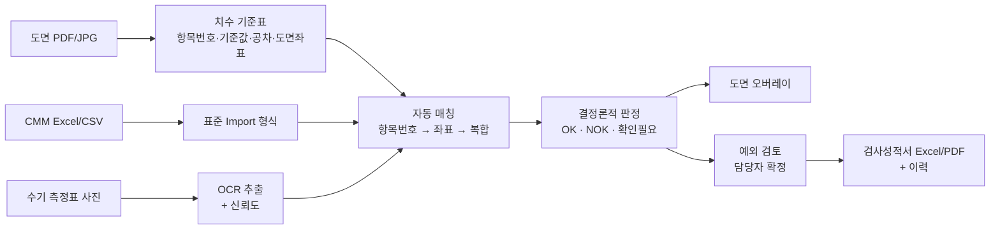
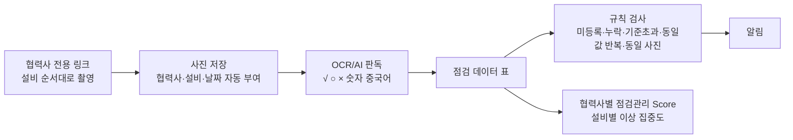
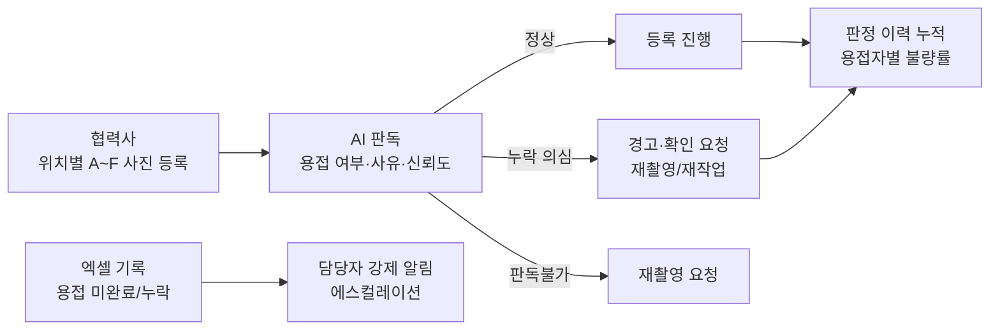

# 초도품 치수검사 자동화 · 협력사 일일점검표 사진 품질관리 · 용접누락 검출 — 프로젝트 기획서

| 항목 | 내용 |
|---|---|
| 리포 | data09-08 |
| 제출자 | 김무연 |
| 직무·소속 | 인천캠퍼스 제품품질팀 (과제 A·B) / 인천캠퍼스 부품품질팀 (과제 C, 게시물 3에 적힌 소속) |
| 과정 | 현장 데이터 디지털화 전문가과정 1차수 |
| 작성일 | 2026-09-28 (v0.3·v0.4·v0.5·v0.6 갱신 2026-09-29, v0.7 갱신 2026-09-30) |
| 문서 상태 | 초안 v0.7 — 2026-09-30 수강생 요청(앞 표지: 3차원 측정기 + 엑셀 판정표 + AI 로 검사 시간이 줄어드는 그림) 반영, 15장. v0.6: 2026-09-29 오후 늦게 수강생 답변 반영(사내 웹서버 배포 안내, 과제 B 를 다른 AI 로 돌리는 문제에 대한 답과 AI 주소 설정), 14장. v0.5: 2026-09-29 메일 자료(과제 A: CMM PDF 성적서 5건·도면 1건·측정실 성적서 엑셀 1건) 반영, 13장. v0.4: 메일 자료(과제 B 중국어 점검표 2종) 반영, 12장. v0.3: 수강생 추가 요청(폐쇄망·사진 등록·번호 없는 도면 매칭) |

> 제출자는 서로 다른 과제 3건을 올렸습니다(2026-09-28에 세 번째 과제 추가). 이 문서는 세 과제를 **과제 A**, **과제 B**, **과제 C**로 나누어 한 문서에 정리합니다.
>
> - **과제 A — AI 기반 초도품 치수검사 자동화 시스템** (게시물 1, 첨부 01)
> - **과제 B — 협력사 설비 일일점검표 사진 기반 품질관리 시스템** (게시물 2, 첨부 02)
> - **과제 C — 용접누락 방지 검출 시스템** (게시물 3, 첨부 03, 2026-09-28 추가)
>
> **1차 개발 대상은 과제 A입니다.** 이유는 세 가지입니다.
> 1. 최종 OK/NOK 판정을 "기준값·공차·측정값으로 계산하는 결정론적 로직"으로 하겠다고 제출자가 이미 정했습니다. 이 핵심은 AI 인식 정확도와 상관없이 지금 바로 만들 수 있습니다.
> 2. 입력(도면·CMM 결과·수기 측정표)이 제품품질팀 안에서 확보됩니다. 과제 B는 중국 협력사의 접속 환경·플랫폼 선정·중국어 손글씨 OCR 검증이 먼저 풀려야 해서 선행 조건이 많습니다.
> 3. 과제 A에서 만드는 "사진 → 숫자 추출 → 확인필요 표시 → 사람이 확정" 흐름을 과제 B가 그대로 재사용할 수 있습니다.
>
> 과제 C는 추가 게시물에서 1차 개발 대상을 바꾸자는 요청이 없어 **1차 개발 대상은 그대로 과제 A**로 둡니다. 과제 C는 사진 판독(AI)이 핵심이라 정상/누락 라벨이 붙은 사진 세트가 먼저 있어야 하므로, 이 문서에서는 1단계 시제품에 무엇이 필요한지까지만 정리합니다. → **2026-09-29 샘플 수령 후 과제 C 는 별도 리포 data09-22 로 나눠 1단계를 개발했습니다**(기획서·개발은 data09-22 에서 이어 갑니다).

---

## 1. 추진 배경과 현안

### 과제 A — 초도품 치수검사

- 초도품 제작 후 도면의 전체 치수를 기준으로 CMM(3차원 측정기)과 작업자 수기 측정을 함께 합니다.
- 측정항목이 많아 측정결과와 도면 치수를 하나하나 대조하는 데 시간이 많이 걸립니다.
- 제출자가 정리한 현행 문제는 다음과 같습니다.

| 현행 문제 | 내용 |
|---|---|
| 도면 대조 | 도면의 수많은 치수 중 해당 측정값이 어느 치수인지 수작업 확인 |
| CMM 결과 | Excel/CSV 결과와 도면 항목을 수동으로 연결 |
| 수기 측정 | 종이 검사표의 값을 다시 읽고 분류·입력 |
| 판정 | 기준값/상·하한 공차를 사람이 계산하여 OK/NOK 확인 |
| 불량 위치 확인 | NOK 항목을 다시 도면에서 찾아야 함 |
| 중국 현장 | 한국과 중국의 언어·양식 차이로 데이터 통합이 어려움 |

- 제출자는 "가장 중요한 기술요소는 단순 숫자 OCR이 아니라 측정값이 도면의 어느 치수인지를 연결하는 것"이라고 짚었습니다.

### 과제 B — 협력사 설비 일일점검표

- 협력사가 설비별 일일점검을 하지만 점검표 대부분이 수기로 작성되어 본사가 점검 활동을 체계적으로 확인하기 어렵습니다.
- 점검표 작성 미비·관리 부족이 설비 관리 부족으로 이어져 하자가 발생합니다.
- 제출자가 든 관리상의 한계는 다음과 같습니다.
  - 협력사별 점검표 양식이 서로 다름
  - 수기 작성이라 데이터화가 어려움
  - 제출 여부를 일일이 확인해야 함
  - 미작성·누락을 빨리 파악하기 어려움
  - 측정값 추세·이상을 체계적으로 분석하기 어려움
  - 실제로 점검했는지 사후 검증이 어려움
- 이상점(동일 사진, 기입불량, 치수 불량)이 생기면 알림을 받고 싶어 합니다.

### 과제 C — 용접누락 방지 검출 (2026-09-28 추가)

- 대상 공정은 Boom/Arm 내부용접이고, 대상 협력사는 엑셀 검사성적서를 제출하는 협력사 전체입니다(첨부 03 표제 표).
- 협력사는 용접 사진을 가이드에 맞게 찍어 엑셀 검사성적서에 등록하고, 회사 포털에서 업로드 권한을 받아 파일을 올립니다.
- 용접이 되지 않은 제품의 사진이 올라왔지만 걸러지지 않았고, 그 제품이 조립되어 고객 사용 중 깨지는 하자가 발생했습니다.
- 제출자가 정리한 검출 실패 지점은 두 곳입니다.
  - 협력사의 내부용접 사진 촬영 시 미검출
  - 사진 등록 및 본사 검토 시 미검출
- 근본 원인은 "불량 정보가 이미 있었는데 확인하고 걸러내는 절차가 없었던 프로세스 단절"로 적었습니다. 협력사가 낸 엑셀 검사성적서에서도 용접이 안 된 상태가 이미 확인되는 건이었습니다.
- 경영진으로부터 재발방지 장치 마련과 "협력사 업로드 시점 AI 용접누락 감지 가능 여부 검토"가 요청되었습니다.
- 게시물 3에는 "해당 용접자의 불량률도 누적하여 확인"하고 싶다는 요구가 추가로 적혀 있습니다.

## 2. 목표

### 최종 목표

- **과제 A**: 도면을 기준으로 CMM 측정값과 작업자 수기 측정값을 하나의 검사 데이터로 묶고, 자동 판정과 도면 위 불량 위치 표시를 제공하는 품질검사 웹 시스템. 한국·중국 공장이 같은 시스템을 씁니다. 사람은 AI가 판단하기 어려운 항목과 예외만 확인합니다.
- **과제 B**: 협력사의 행동은 "매일 점검표를 작성하고 사진으로 등록한다"로 단순화하고, 본사는 사진을 바탕으로 "제대로 점검했는가 → 이상은 없는가 → 이상 징후가 늘고 있는가 → 실제 품질문제와 연결되는가"를 데이터로 관리합니다.

- **과제 C**: 협력사가 검사성적서 엑셀을 작성·업로드하는 시점에 첨부 사진을 판독해 용접누락을 바로 감지하고, 미용접 제품이 본사 입고·조립 공정으로 넘어가지 않게 합니다. 판독 결과는 협력사·본사 담당자에게 공유하고, 용접자별 불량률을 누적합니다. 제출자는 AI 판독을 "보완적 안전망"으로 두고, 엑셀에 "용접 미완료/누락"으로 기록된 항목의 강제 알림·조립 투입 전 확인 체크포인트를 함께 두겠다고 적었습니다.

### 1차 개발 목표 (과제 A)

- 도면 치수 기준표(항목번호·기준값·공차)와 CMM 측정결과(Excel/CSV)를 올리면 **항목번호로 매칭해 OK / NOK / 확인필요를 자동 판정**합니다.
- 도면 이미지 위에 치수 항목 위치를 찍어 두면, 판정 결과를 **녹색(OK) / 빨간색(NOK) / 노란색(확인필요)** 으로 겹쳐 보여 줍니다.
- 결과를 검사성적서 형태의 Excel로 내려받습니다.
- 도면 치수 자동 인식(OCR)과 손글씨 측정표 인식은 2단계 이후로 둡니다.

## 3. 보유 데이터

> 실제 샘플 파일은 아직 받지 않았습니다. 아래는 제출 문서에 적힌 데이터 종류와 제출자가 PoC용으로 준비하겠다고 적은 자료입니다.

| 데이터 | 형태 | 규모·주기 | 비고(민감도 등) |
|---|---|---|---|
| [A] 초도품 도면 | PDF 또는 고해상도 이미지(JPG) | PoC용 1~3종 (첨부 01 §14) | 사내 도면 — 기밀. 해외(중국) 전송 여부는 회사 보안정책 검토 대상이라고 제출자가 명시 |
| [A] CMM 측정결과 | Excel/CSV (장비 출력) | 도면과 같은 품번 | 컬럼 구조 미확인. 제출 문서상 포함 정보: 측정값·측정번호·단위·항목명 |
| [A] 수기 측정표 | 종이 검사표 사진(휴대폰·PC 촬영) | 도면과 같은 품번 | 인쇄문자 + 손글씨 혼합. 중국 현장은 중국어 문구와 숫자 혼합 |
| [A] 검사성적서 양식 | 현재 사용 양식 | 1종 이상 | 출력 형식의 기준 |
| [A] 품번/Rev·공차 표기 규칙 | 문서 | — | 단측공차·± 공차·소수점 자리수 규칙 |
| [A] 과거 검사 사례 | 정상/불량이 확인된 기록 | "가능하다면" | 판정 로직 검증용 |
| [B] 협력사 일일점검표 사진 | 휴대폰 촬영 사진 | 매일, 협력사×설비 수만큼 | 양식이 협력사마다 다름. 중국어 수기 포함. 작업자 이름이 적혀 있어 개인정보 관리 기준 필요 |
| [B] 추출 목표 데이터 | 표(협력사·점검일·설비·점검항목·판정·측정값·원본사진) | 제출 문서의 예시 구조 | 예시 값(A사 1호기 압력 18.2 등)은 설명용 예시로 보임 (가정) |
| [C] 용접 사진(양호/불량) | 위치별(A~F) 내부용접 사진, 엑셀 검사성적서에 등록된 형태 | 수량 미확인 | 제출자가 실제 제출 사진을 검토해 보니 위치에 따라 어둡거나 초점이 맞지 않은 사진이 다수라고 적음. 사고가 난 B·E 위치 샘플을 우선 확보할 계획 |
| [C] 협력사 내부용접 검사성적서 | 엑셀(사진 + 기록) | 제출 건마다 | 시트 구조 미확인. "용접 미완료/누락" 기록 칸이 있는 것으로 보임 (가정) |
| [C] 정상/누락 라벨 | 사람이 확인한 판정을 파일명 또는 표에 기록 (예: B위치-정상, E위치-누락) | 확보 예정 (첨부 03 §4.2) | 판독불가 동작 검증용 경계 사례(그을음·어두운 정상 사진)도 포함 예정 |
| [C] 용접자 정보 | 사진·성적서에 연결된 용접자 | 미확인 | 게시물 3의 "용접자 불량률" 요구에 필요. 현재 성적서에 용접자 칸이 있는지 확인 필요. 개인정보 관리 기준 대상 |

## 4. 해결 방안 개요

### 과제 A

제출자가 정리한 업무 흐름: ① 품번/Rev 등록 → ② 도면 업로드 → ③ AI 치수 추출 및 번호화 → ④ CMM 결과 업로드 → ⑤ 수기 측정표 촬영 업로드 → ⑥ AI/OCR 항목 분류 → ⑦ 자동 매칭 → ⑧ 공차 자동판정 → ⑨ 도면 NOK 표시 → ⑩ 품질담당자 예외 검토 → ⑪ 검사성적서 확정 → ⑫ 이력 저장

제출자가 정한 매칭 단계:

| 매칭 수준 | 방법 | 활용 |
|---|---|---|
| 1단계 | 항목번호/명칭 직접 매칭 | 표준화된 검사표에 적합 |
| 2단계 | 도면 좌표·치수 텍스트 위치 매칭 | 도면 자동 분석 |
| 3단계 | CMM 항목 및 특징정보 매칭 | CMM 데이터 연계 |
| 4단계 | AI 복합 매칭 + 신뢰도 | 모호한 항목의 후보 비교 |
| 예외 | 사용자 확인 | 불확실한 항목을 강제 판정하지 않음 |

1차 개발은 **1단계(항목번호 직접 매칭)** 만 구현합니다.

### 과제 B

- 협력사: 설비 점검 → 기존과 같이 수기 점검표 작성 → 휴대폰으로 등록 링크 접속 → 설비 순서대로 사진 업로드 → 제출
- 본사: 사진 자동 수집 → AI/OCR 판독 → 협력사·설비·날짜 자동 분류 → 체크·숫자 데이터화 → 누락·이상 자동 검출 → 협력사별·설비별 분석 → 알림

### 과제 C

제출자가 정한 판별 흐름(첨부 03 §3.2):

| 단계 | 구분 | 내용 |
|---|---|---|
| 1 | 사진 등록 | 협력사가 위치별(A~F) 내부용접 사진을 엑셀 검사성적서에 등록 |
| 2 | AI 판독 | 위치별 사진을 판독해 결과 반환(용접 여부 / 판정 사유 / 신뢰도) |
| 3 | 판정 처리 | 정상 → 등록 진행 / 누락 의심 → 경고 및 확인 요청(재촬영·재작업) / 판독불가 → 재촬영 요청(OK/NG를 억지로 판단하지 않음) |
| 4 | 결과 공유 | 판정 결과를 협력사·본사 담당자에게 메일로 공유 |
| 5 | 이력 관리 | 판정 결과와 사진 이력을 누적해 모델 개선·추적에 활용 |

- 판별 범위는 단계적으로 넓힙니다: 1단계 용접 여부(누락) 판별(비드 유무 이진 판단) → 후속 용접 품질(언더컷·기공) → 개선포인트 제시. 각장(z') 정량 측정은 범위 밖이며 기존처럼 검사원이 실측해 기입합니다.
- 구현 방식은 엑셀 매크로 내장을 유력 대안으로 두고, 기존 업로드 사이트 연동·별도 업로드 페이지와 비교해 관련 부서 협의 후 확정한다고 적었습니다. 보안팀은 문제가 없는 범위에서 사내 에이전트를 사용해 개발하도록 안내했다고 합니다.

## 5. 주요 기능

### 과제 A

| 기능 | 설명 | 우선순위 |
|---|---|---|
| 검사 건 등록 | 품번·Rev·LOT·검사일·업체·검사자 입력 | MVP |
| 치수 기준표 입력 | 도면 치수를 표로 입력(항목번호·치수 종류·기준값·상/하 공차·단위). Excel 붙여넣기 지원 | MVP |
| CMM 결과 가져오기 | Excel/CSV 업로드 → 컬럼 지정(측정번호·항목명·측정값·단위) → 표준 형식 변환. 장비별 매핑 템플릿 저장 | MVP |
| 자동 판정 | 기준치와 공차로 상·하한 계산, 측정값 판정. ± 공차·단측공차·단위 변환·소수점 자리수를 규칙으로 관리 | MVP |
| 확인필요 분류 | 매칭 실패·값 누락·단위 불일치는 판정하지 않고 "확인필요"로 표시 | MVP |
| 도면 오버레이 | 도면 이미지 위에 항목 위치를 클릭해 핀 등록 → 판정 색(녹/적/황) 표시, 핀 클릭 시 기준값·공차·측정값·편차 표시 | MVP |
| 통합 검사결과 표 | 전체 치수별 기준/측정/공차/편차/판정 | MVP |
| 검사성적서 출력 | 결과를 Excel로 내보내기 (현재 양식에 맞춤) | MVP |
| 수기 측정표 OCR | 사진에서 항목번호·숫자 추출, 신뢰도 저장, 원본 사진과 대조 후 확정 | 확장 |
| 도면 치수 자동 인식 | 선형치수·직경/반경·각도·깊이·위치치수 추출 + 도면 좌표. 이후 GD&T로 확대 | 확장 |
| 좌표·복합 매칭 | 매칭 2~4단계 | 확장 |
| 예외 검토 화면 | 신뢰도 낮은 항목 승인/수정, 수정 이력(누가·언제·무엇) | 확장 |
| 대시보드·이력 검색 | 검사 건수, OK/NOK/확인필요, 품번·Rev·업체·LOT별 조회 | 확장 |
| 한·중·영 다국어 UI, 권한 | 본사/중국법인/협력사별 접근권한 | 확장 |
| SPC·Cp/Cpk, 반복 불량 알림, CAPA 연계 | 제출 문서 "향후 확장 기능" | 확장 |

### 과제 B

| 기능 | 설명 | 우선순위 |
|---|---|---|
| 협력사 전용 업로드 링크 | 링크로 협력사 자동 식별, 사전 정의된 설비 순서대로 사진 업로드. 설치 없이 휴대폰 브라우저에서 동작 | MVP |
| 등록 현황판 | 협력사별·설비별 당일 등록 여부(미등록 설비 표시) | MVP |
| 동일 사진 검출 | 이전에 올린 사진과 같은 사진 재업로드 검출(이미지 해시) | MVP |
| 점검 데이터 표 | 협력사·점검일·설비·점검항목·판정·측정값·원본사진. 초기에는 사람이 사진 보며 입력하거나 OCR 결과를 확인 | MVP |
| 규칙 기반 이상 검출 | 빈칸·체크 누락·측정값 미기입·서명 누락, 기준값 이탈, 동일값 장기 반복("확인 필요"로만 분류, 부정행위로 자동 판정하지 않음) | MVP |
| 알림 | 이상 발생 시 담당자 메일 알림 (과정 DAY5 Make) | 확장 |
| 점검표 OCR | √·○·×·숫자·중국어 손글씨 인식 → 표 자동 생성 | 확장 |
| 추세 분석 | 측정값 지속 상승·하락 감지 | 확장 |
| 협력사 점검관리 Score | 등록률·누락률·측정값 누락률·기준 초과·동일값 반복·조치 기록 | 확장 |
| 품질 데이터 연계 | 공정불량·출하검사·고객불량 데이터와 연결 | 확장 |

### 과제 C

| 기능 | 설명 | 우선순위 |
|---|---|---|
| 위치별 사진 등록 | 검사 건(품번·LOT·협력사·용접자)마다 A~F 위치별 사진 등록, 위치별 필수 등록 항목 지정 | MVP |
| 용접누락 판독 | 위치별 사진의 용접 비드 유무를 판독해 정상 / 누락 의심 / 판독불가와 판정 사유·신뢰도를 반환. 불확실하면 판독불가로 처리 | MVP |
| 판정 처리·재촬영 요청 | 누락 의심은 경고·확인 요청, 판독불가는 재촬영 요청 | MVP |
| 엑셀 기록 기반 강제 알림 | 검사성적서에 "용접 미완료/누락"으로 기록된 항목이 있으면 AI 판독과 관계없이 담당자 알림·에스컬레이션 (병행 조치) | MVP |
| 판정 이력·용접자별 불량률 | 판정 결과와 사진 이력 누적, 용접자별·위치별·협력사별 누락 의심 비율 집계 (게시물 3 요구) | MVP |
| 결과 메일 공유 | 협력사·본사 담당자에게 판정 결과 메일 (수신 대상·에스컬레이션 기준은 미정) | 확장 |
| 파일럿 성능 측정 | 라벨된 정상/누락 사진으로 누락 미검출(불량을 정상으로 오판) 건수·오탐률·판독불가 비율 측정 | 확장 |
| 용접 품질 판별 | 언더컷·기공 등 (불량 샘플 축적 후) | 확장 |
| 개선포인트 제시 | "의심 부위 표시" 수준의 1차 스크리닝부터 | 확장 |

## 6. 기대 산출물

- **과제 A**
  - 치수검사 판정 웹 도구 (치수 기준표 + CMM 결과 → 판정표 + 도면 오버레이 + 성적서 Excel)
  - 공차 판정 규칙 명세(± 공차·단측공차·단위·자리수)와 검증용 테스트 사례
  - CMM 장비별 Import 매핑 템플릿
  - (2단계) 수기 측정표 OCR 검증 결과 보고 — 인식률·확인필요 비율
- **과제 B**
  - 협력사용 모바일 업로드 페이지 + 본사 등록 현황판
  - 점검 데이터 표준 구조(협력사·점검일·설비·점검항목·판정·측정값·원본사진)
  - 이상 검출 규칙 목록과 알림 시나리오
  - (Pilot) 중국어 수기 점검표 OCR 정확도 검증 결과
- **과제 C**
  - 위치별 촬영 표준 가이드(제출자 선행 과제)에 맞춘 사진 등록·판독 흐름
  - 판독 결과 형식(용접 여부 / 판정 사유 / 신뢰도)과 판정 처리 규칙
  - 파일럿 성능 측정표(누락 미검출·오탐·판독불가)와 용접자별 불량률 누적표

## 7. 기술 구성

| 과정 도구 | 과제 A 적용 | 과제 B 적용 |
|---|---|---|
| DAY1 암묵지 자산화 | 공차 표기 규칙·판정 기준·매칭 요령 정리 | 점검항목·관리 기준값·협력사별 설비 순서 정리 |
| DAY2 코랩(Python) | CMM CSV 정리·판정 로직 검증 스크립트 | 누적 점검 데이터 등록률·동일값 반복·추세 분석 |
| DAY3 멀티모달(OCR·도면) | 도면 치수 추출, 수기 측정표 숫자 인식 | 점검표 사진의 체크·숫자·중국어 인식 |
| DAY4 RAG(Dify·NotebookLM) | (선택) 공차 규칙·검사 기준서 질의 | (선택) 점검 기준서 질의 |
| DAY5 Make 자동화 | NOK 발생 시 메일 알림 | 미등록·이상 발생 시 메일 알림, Sheets 누적 |
| 생성형 AI | 모호한 항목의 매칭 후보 제시(최종 판정은 계산 로직) | OCR 보조, 이상 사유 요약 |

**개발 형태 (가정)**

- **1차(과제 A MVP): 설치 없이 브라우저에서 도는 정적 웹 도구.** 파일은 브라우저 안에서만 읽고 서버로 보내지 않습니다. 도면이 기밀이므로 이 방식이 보안 검토 부담이 가장 적습니다.
  - Excel/CSV 읽기·쓰기: 브라우저용 스프레드시트 라이브러리
  - 도면 표시: PDF는 브라우저 PDF 렌더러로 이미지화, 그 위에 SVG 핀 오버레이
  - 판정 로직: 순수 함수로 분리해 테스트 사례로 검증
- 2단계 OCR은 외부 AI 서비스로 도면·사진을 보내야 하므로 **회사 보안정책 확인 후** 결정합니다. 사내 전용이 필요하면 Python(로컬) OCR 스크립트로 대체합니다.
- 과제 B는 협력사가 외부에서 사진을 올려야 하므로 **서버(저장소)가 반드시 필요**합니다. 중국 현지 접속성 테스트 결과에 따라 플랫폼을 고릅니다(제출자 명시 사항).
- 과제 C는 제출자가 구현 방식(엑셀 매크로 / 기존 업로드 사이트 연동 / 별도 업로드 페이지)을 관련 부서와 협의 중이고, 보안팀이 사내 에이전트 사용을 안내했습니다. 판독 모델·서비스는 이 협의 결과에 따라 정합니다. 파일럿 단계에서는 사진을 사내 에이전트에 넣고 정해진 형식(위치·용접 여부·사유·신뢰도)으로 답을 받는 반자동 방식이 가장 부담이 적습니다 (가정).

## 8. 개발 단계

### 1단계 — 지금 바로 개발 가능한 부분

**과제 A (1차 개발 대상)**

지금 가진 정보만으로 만들 수 있는 것:

1. **공차 판정 엔진** — 기준값·상한공차·하한공차·측정값·단위·소수점 자리수를 받아 OK/NOK/확인필요와 편차를 내는 계산 로직. ± 공차와 단측공차를 모두 처리합니다.
2. **치수 기준표 입력 화면** — 항목번호·치수 종류(선형/직경/반경/각도/깊이/위치)·기준값·공차를 표로 입력하거나 Excel에서 붙여넣습니다.
3. **CMM 결과 가져오기** — CSV/Excel을 올리고 어느 열이 측정번호·항목명·측정값·단위인지 사용자가 지정합니다. 실제 파일 구조를 모르므로 **컬럼 지정 방식**으로 만듭니다.
4. **항목번호 직접 매칭 + 판정표** — 매칭 안 된 항목은 확인필요.
5. **도면 오버레이** — 도면 이미지를 올리고 항목 위치를 클릭해 핀을 찍으면 판정 색으로 표시.
6. **성적서 Excel 내보내기** — 일단 범용 양식, 실제 양식을 받으면 맞춥니다.
7. 샘플 데이터는 **가상의 부품·가상 치수로 만든 예제**로 시연합니다. 실제 도면은 받은 뒤 교체합니다.

**과제 B**

- 설비 목록(협력사·설비번호·순서)을 표로 넣으면 **당일 등록 현황판**과 **동일값 반복·기준값 이탈 규칙 검사**를 도는 분석 화면은 입력 표만 있으면 만들 수 있습니다. 사진 업로드 서버와 OCR은 1단계에서 제외합니다.

**과제 C (이 리포에서는 만들지 않음 → data09-22 로 분리, 2026-09-29 1단계 개발)**

- 판독 자체는 라벨된 사진 없이 검증할 수 없으므로 1단계에서 만들지 않습니다. → 2026-09-29 성적서 샘플을 받아 **data09-22**(https://github.com/aebonlee/data09-22)에서 성적서 읽기·규칙 점검·사람 판정·용접사별 누적을 1단계로 만들었습니다. 아래 목록은 당시 계획으로 남겨 둡니다.
- 1단계 수준 시제품을 만들려면 다음이 먼저 필요합니다.
  1. **정상/누락 라벨이 붙은 용접 사진 세트** — A~F 위치별 정상/누락 쌍, 사고가 난 B·E 위치 우선, 판독불가 검증용 경계 사례(그을음·어두운 정상 사진) 포함. 라벨은 "B위치-정상", "E위치-누락"처럼 파일명이나 표에 기록.
  2. 실제 협력사 내부용접 검사성적서 엑셀 1건 — 사진 위치·"용접 미완료/누락" 기록 칸·용접자 칸의 위치 확인용.
  3. 사내 에이전트에 사진을 넣어도 되는지와 답을 받을 형식 합의.
- 이것이 확보되면 만들 수 있는 1단계 시제품의 모습 (가정):
  - 검사 건별로 위치 A~F 사진을 등록하고, 사내 에이전트용 판독 요청문을 만들어 복사 → 받은 답(위치·용접 여부·사유·신뢰도)을 붙여 넣으면 정상/누락 의심/판독불가로 정리
  - 엑셀 성적서의 "용접 미완료/누락" 기록을 읽어 AI 판독과 별도로 경고
  - 라벨과 판독 결과를 대조해 누락 미검출·오탐·판독불가 건수를 세는 파일럿 성능표
  - 판정 이력으로 용접자별·위치별 누락 의심 비율 누적표

### 2단계

- 과제 A: 수기 측정표 사진 OCR(인쇄 숫자 우선, 손글씨는 신뢰도 표시) + 예외 검토 화면(원본 사진 대조 후 확정, 수정 이력) + 실제 성적서 양식 반영. 실제 도면 1~3종으로 인식률·확인필요 비율을 잽니다.
- 과제 B Pilot: 협력사 1~2개사·주요 설비 일부로 모바일 업로드 링크 운영, 중국 현지 접속 테스트, 중국어 수기 인식 테스트.
- 과제 C 파일럿(제출자 추진 단계 1): 용접누락 판별만 대상으로 판독 요청문을 설계·시험하고 기존 수동 검토와 병행 운영합니다. 제출자가 정한 완료 기준은 "누락 미검출(불량을 정상으로 오판) 없음 확인, 오탐률 측정"입니다.

### 3단계

- 과제 A: 도면 치수 자동 인식과 좌표·복합 매칭, GD&T 확대, 이력 DB·권한, 한·중·영 다국어, NOK 알림, SPC(Cp/Cpk)·반복 불량 추세.
- 과제 B: OCR 자동 데이터화, 추세 분석, 협력사 점검관리 Score, 대상 협력사 확대, 공정불량·고객불량 데이터 연계.
- 과제 C: 협력사 업로드 시점 자동 판별과 메일 공유를 전 협력사에 적용(제출자 추진 단계 2), 이후 용접 품질 판별·개선포인트 제시(추진 단계 3). 일정은 관련 부서 협의 후 단계별로 확정한다고 제출자가 적었습니다.

## 9. 기대 효과

- **과제 A**
  - 측정값과 도면 치수를 사람이 일일이 대조하던 일을 자동 매칭·자동 판정으로 바꿉니다.
  - NOK 위치를 도면에서 다시 찾지 않고 바로 확인합니다.
  - 수기 측정값 재입력이 줄고, 판정이 계산 로직으로 일정해집니다.
  - 원본 도면·사진·측정파일과 최종 판정이 연결되어 추적이 가능해집니다.
  - 제출자가 제시한 목표 예시는 "초도품 검사 분석시간 50~80% 단축"이며, 제출자 스스로 **가설적 목표이고 PoC에서 기준시간을 잰 뒤 확정한다**고 밝혔습니다.
- **과제 B**
  - 제출 여부를 사람이 확인하던 부담이 줄고 미등록·누락이 바로 보입니다.
  - 협력사는 새 Excel 작성 없이 기존 점검표를 찍어 올리기만 합니다.
  - 기준 초과·추세 변화로 이상을 일찍 발견하고, 협력사 점검 활동을 정량 데이터로 비교합니다.
  - 장기적으로 일일점검 데이터와 불량 데이터를 연결해 불량 이전의 이상징후를 관리합니다.

- **과제 C**
  - 미용접 제품의 본사 입고·조립 공정 유입을 막습니다(재발방지).
  - 불량 발견 시점을 협력사 단계로 앞당겨 유출 비용과 시장 하자 위험을 줄입니다.
  - 검토 담당자의 사진 수작업 검토 부담이 줄어듭니다.
  - 제출자가 제시한 성과지표(안)는 "용접누락 제품 본사 유입 0건", "누락 미검출률은 파일럿에서 0건 확인 후 본 적용(수치 기준은 파일럿 결과로 확정)", "판독불가(재촬영) 비율 감소 추이 관리"입니다.

## 10. 확인 필요 사항

**과제 A**

1. 실제 CMM 출력 파일 샘플(Excel/CSV) 1건 — 열 이름·측정번호 체계·단위 표기를 확인해야 Import 템플릿을 만들 수 있습니다. 장비가 여러 종류인지도 알려 주십시오.
2. 도면에 치수 번호(풍선 번호)가 매겨져 있습니까? 1단계 매칭은 이 번호에 기댑니다. → **2026-09-29 답: 있는 도면과 없는 도면이 섞여 있음.** 번호 없는 도면은 자동 번호 풍선 + 기준값·공차 짝 제안으로 처리(11장).
3. 공차 표기 규칙 문서 — ± 공차, 단측공차, 일반공차(도면 표제란) 적용 방식, 소수점 자리수 처리(반올림 시점).
4. 수기 측정표 양식 사진 1~2장과 현재 검사성적서 양식.
5. 초도품 한 건당 치수 항목 수와 월 검사 건수(ROI 기준선용, 제출 문서에 수치 없음).
6. 도면을 외부 AI 서비스(클라우드 OCR)로 보내도 되는지 — 보안정책상 불가라면 OCR은 사내 설치형으로 가야 합니다. → **2026-09-29 답: 도면 외부 유출 불가.** 폐쇄망 모드(기본 켬)로 대응(11장).
7. 중국 현장 적용 시 도면의 해외 전송 가능 여부, 데이터 저장 위치(제출자가 검토 항목으로 명시).

**과제 B**

1. 협력사 점검표 양식 샘플 사진(한국·중국 각 1종 이상). → **2026-09-29 메일로 중국어 양식 2종 받음**(12장). 한국 양식 여부는 12.4.
2. 대상 협력사 수와 협력사당 설비 수, Pilot 대상 1~2개사.
3. 점검항목별 관리 기준값(상·하한) 목록.
4. "동일 사진" 판정 기준 — 완전히 같은 파일인지, 같은 종이를 다시 찍은 것까지 잡아야 하는지.
5. 중국 현지에서 쓸 수 있는 업로드 채널(WeChat 링크 공유 등) 후보와 접속 테스트 가능 여부.
6. 점검표에 적힌 작업자 이름 등 개인정보 보관 기준.

**과제 C**

1. 정상/누락 라벨이 붙은 용접 사진 세트 — 위치(A~F)별, B·E 위치 우선, 경계 사례 포함. 1단계 시제품의 전제 조건입니다.
2. 실제 협력사 내부용접 검사성적서 엑셀 1건 — 사진이 어느 칸에 붙는지, "용접 미완료/누락" 기록 칸과 용접자 칸이 있는지.
3. 용접자 불량률을 어떤 단위로 볼지 — 용접자 식별 방법(이름·사번·협력사 내부 번호), 분모(검사 건 수 / 위치 수), 집계 기간.
4. 누락 의심 시 등록 차단(강제)으로 할지, 경고 표시(권고)로 할지 (제출자 결정 사항 1).
5. 구현 방식 확정 — 엑셀 매크로 / 기존 업로드 사이트 연동 / 별도 업로드 페이지 (제출자 결정 사항 2).
6. 사내 에이전트에 용접 사진을 넣어도 되는 범위와 답 형식.
7. 결과 메일 수신 대상(협력사·본사 담당자)과 에스컬레이션 기준, 촬영 가이드 배포 시기와 파일럿 대상 협력사.
8. 과제 C의 소속이 부품품질팀으로 적혀 있습니다. 과제 A·B(제품품질팀)와 같은 담당으로 진행하는지 확인이 필요합니다.

## 11. 2026-09-29 수강생 추가 요청

패들릿 녹색 카드(2026-09-29 00:32 UTC, 첨부 없음). 원문 전체는 `docs/source/2026-09-29_패들릿_추가요청.md`.

### 11.1 원문과 반영 방식

| # | 원문(인용) | 해당 과제 | 반영 방식 |
|---|---|---|---|
| 1 | 「사진으로 도면을 촬영 혹은 업로드 하려했는데 도면 유출이 안 됩니다. 혹시 사내망을 통해 사용할 수 있는 방법은 있을까요?」 | A | **폐쇄망 모드(기본 켬)** — 이 도구는 서버 없는 정적 파일 묶음이라, 저장소를 ZIP 으로 받아 사내 PC 에 옮기고 `index.html` 을 열면 인터넷 없이 모든 기능이 동작합니다. 외부 CDN 0건, 서버 전송 0건. 외부로 요청하는 코드는 폐쇄망 모드를 껐을 때의 「AI 읽기」(`js/ai.js`) 한 곳뿐이고, `index.html` 의 Content-Security-Policy(`connect-src https://api.openai.com`)가 그 밖의 주소 연결을 브라우저 차원에서 막습니다(→ 14장에서 AI 주소를 설정할 수 있게 하며 `https:` 로 넓힘). 화면 위 띠와 푸터에 「이 화면은 어떤 데이터도 외부로 보내지 않습니다」를 표시하고, 「설정·데이터」에 폐쇄망 사용법(ZIP 받기 → 사내 PC 복사 → index.html 열기 → 데이터는 그 PC 브라우저 저장소와 내보낸 파일에만 남음)을 넣었습니다. 네트워크 요청 코드가 없다는 것은 `test/logic.test.mjs` 「폐쇄망」 검사가 파일 전체를 훑어 확인합니다. |
| 2 | 「CMM은 엑셀 혹은 PDF 로 등록할 수 있을 것 같으나, 수기는 사진 촬영을 통해 등록했으면 합니다. 다만 … 사내망 혹은 폐쇄망에서 사용이 가능해야될 것 같습니다.」 | A | **CMM 엑셀**: 1단계부터 동작(브라우저 안 SheetJS). 기준값(Nominal)·공차(+Tol/-Tol, 한 칸 표기) 열을 선택 지정할 수 있게 넓혔습니다. **CMM PDF**: 「PDF 성적서 글자 붙여넣기」 — PDF 뷰어에서 표를 드래그해 복사한 글자를 줄·칸으로 나눈 뒤 열 지정. **수기 사진**: 「수기 측정표 사진으로 등록」 — 휴대폰에서는 카메라가 바로 열리고(`capture=environment`), 사진을 확대·회전하며 옆 입력표(기준표 항목별 측정값 칸)에 옮겨 적습니다. 사진은 저장하지 않고 화면에만 띄우며, 등록한 측정값에 사진 파일 이름만 남깁니다. |
| 3 | 「도면에 번호가 있는 경우가 있고, 없는 경우도 있는데, 없다면 알아서 번호를 매기고 측정결과와 매칭하는 방식으로 … 측정 결과에 기준이 있고, 결과가 나오니 매칭이 가능할 듯 합니다.」 | A | **번호 있음**: 종전대로 항목번호 직접 매칭 + 핀 찍기. **번호 없음**: ① 「도면 보기 → 번호 풍선 새로 찍기(자동 번호)」로 도면을 누를 때마다 1, 2, 3… 풍선과 기준표 항목이 생기고, 옆에서 기준값·공차를 적습니다. ② 측정결과에 기준값·공차가 있으면 「번호 없는 측정 짝 맞추기」가 같은 기준값·공차의 도면 항목을 신뢰도(높음/보통/낮음)와 근거를 붙여 제안하고, 사람이 확인한 줄만 반영합니다. 같은 기준 항목이 여럿이면(예: Ø8 +0.05/0 구멍 두 개) 측정 순서대로 짝짓고 신뢰도를 「보통」으로 낮춥니다. ③ 기준표가 비어 있으면 「기준값으로 기준표 항목 만들기(자동 번호)」로 측정결과에서 기준표를 만들고 번호를 매깁니다. 매칭 로직은 `js/logic.js`(`suggestMatches`·`applyMatches`·`specFromMeas`) + 테스트. |
| 4 | 「과제 B 같은 경우는 협력사에서 사용하는 방식이라 따로 보안은 없어도 되고, 사진촬영을 통해 데이터를 인식해야되는데 사진을 올릴 수 있는 방식을 구현할 수 있을까요?」 | B | 「일일점검 → 점검표 사진으로 등록」: 협력사·설비·점검일을 고르고 점검표를 찍으면 점검항목(관리 기준값 목록으로 미리 채움)별 판정·측정값을 옮겨 적어 등록합니다. **폐쇄망 모드를 끄면 「AI 읽기」**가 나타나 사용자 본인의 OpenAI API 키로 비전 모델을 불러 사진을 표(JSON)로 읽고, 표에 채워만 둔 뒤 사람이 확인해 등록합니다(키는 그 브라우저에만 저장, 리포·백업에 없음). 키 없이 쓰는 반자동(요청문 복사 → ChatGPT 에 사진과 함께 붙여넣기 → 답 붙여넣기)도 함께 둡니다. 사진 파일 지문(hash)을 남겨 같은 사진을 다른 날·설비에 다시 올리면 경고하고 규칙 검사에 「같은 사진 — 확인 필요」로 표시합니다(기획서 5장 과제 B 「동일 사진 검출」 MVP). |

### 11.2 그대로 못 한 것과 이유

- **사진 속 숫자 자동 인식(OCR)을 폐쇄망에서 하는 것** — 브라우저에는 글자 인식 기능이 내장돼 있지 않습니다. 브라우저용 OCR 엔진(tesseract.js)은 언어 데이터까지 수십 MB 라 도구 폴더에 넣기에 무겁고, 손글씨 숫자 인식률도 검증되지 않았습니다. 그래서 폐쇄망에서는 **사진 옆 입력표 + 확대·회전 보기로 옮겨 적기**를 구현했고, 자동 읽기는 보안 요구가 없는 경우(과제 B·연습 사진)에만 「AI 읽기」로 붙였습니다. 사내 전용 자동 인식이 꼭 필요하면 사내 설치형 OCR(보안팀이 안내한 사내 에이전트 등)과 연결하는 것이 다음 단계입니다(10장 과제 A 6번).
- **PDF 를 파일째 읽기** — PDF 해석 라이브러리는 파일 크기가 크고 `file://` 에서 작업 스레드(worker)가 막히는 브라우저가 있어, 복사한 글자를 붙여 넣는 방식으로 대신했습니다. 스캔(그림) PDF 는 글자를 복사할 수 없으니 사진처럼 옮겨 적습니다. → **2026-09-29 오후 해결(13장)**: pdf.js 를 `vendor/` 에 넣고 화면 스레드에서 돌려 `file://` 에서도 CALYPSO PDF 를 파일째 읽습니다.
- **과제 B 의 협력사 원격 업로드** — 협력사가 각자 휴대폰으로 올린 사진을 본사 한 곳에 모으려면 서버(저장소)가 필요합니다(7장). 이번에는 한 브라우저에서 사진을 보고 등록하는 데까지이며, 여러 협력사가 모으는 링크는 플랫폼(중국 현지 접속성 포함) 결정 뒤에 붙입니다.
- **사진 보관** — 사진은 브라우저 저장소 용량(보통 5MB 안팎)과 보안 때문에 저장하지 않고 파일 이름·지문만 남깁니다. 원본 사진은 사내 경로에 따로 보관해 주십시오.

### 11.3 남은 확인사항 (수강생)

1. (답변 받음 → 14장: ZIP 반입 가능, 사내 웹서버에 올려 여럿이 쓰기를 원함) 폐쇄망 사용 방식 — 사내 PC 에 ZIP 을 반입하는 것이 보안 절차상 가능한지, 아니면 사내 웹서버에 올려 여러 명이 같은 주소로 쓰기를 원하는지(사내 웹서버라면 폴더째 올리면 됩니다).
2. CMM PDF 성적서 1건(가상 값으로 바꾼 것) — 뷰어에서 복사했을 때 칸이 어떻게 나뉘는지 보고 「PDF 붙여넣기」를 맞추겠습니다.
3. (확인됨 → 14장: 기준값·공차 열 있음) CMM 출력에 기준값·공차 열이 실제로 있는지, 측정번호가 도면 풍선 번호와 다른 체계인지.
4. (「공유 완료」 답변 → 13장 측정실 성적서 엑셀로 반영, 같은 양식인지 14.5-1 확인) 수기 측정표 양식 사진 1장(가상 값) — 입력표 순서를 양식 순서와 맞추겠습니다.
5. 과제 B 에서 AI 읽기에 쓸 계정·키를 누가 관리할지(협력사별 / 본사 1개), 중국어 점검표 사진으로 인식률 시험이 가능한지.

## 12. 2026-09-29 메일 자료 반영(과제 B)

제출자 메일(대표 전달)로 협력사 설비 일일점검표 사진 2장이 왔습니다. 원문과 양식 구조는 `docs/source/2026-09-29_메일_과제B_샘플.md`.
사진 원본은 저장소에 넣지 않았습니다(협력사 회사명·설비 번호·손 서명·이름이 찍혀 있음). 구조만 옮기고 예시 데이터는 가상 협력사·설비A/설비B·가명 보전자로 만들었습니다.

### 12.1 양식에서 알게 된 것

| 구분 | 사진 ① 数控机床点检表 (CNC 공작기계) | 사진 ② 设备日常点检项目表 (CNC 호빙기) |
|---|---|---|
| 한 장의 범위 | **한 설비 한 달** — 날짜 1~16 / 17~말일 두 줄 | 한 설비, 날짜 1~16 × **日/中 두 칸** (17일~ 장은 받지 못함) |
| 점검항목 | 9개 (중국어 인쇄) | 13개 (중국어 인쇄) |
| 숫자 항목 | 1번 유압 5~7MPa, 8번 절삭유 농도 7~12% | 9번 시스템 총압력 4~5MPa |
| 나머지 | ✓ 표시. 7번(누설 유무)은 「无(없음)」으로 적음 | ✓ 정상 / × 설비 이상 (범례 인쇄) |
| 서명 | 9번 줄 — **날마다** 작업자 서명 | 머리칸 **보전인(保养人)** 한 번 |
| 기타 | 작성 요령: 매월 1일 배포·회수, 표 변경 시 설비부 통보 | 「异常情况记录」(이상 상황 기록) 칸 |

- 1단계에서 가정한 「사진 한 장 = 하루 한 설비」가 아니라 **「사진 한 장 = 한 설비 한 달 격자」** 입니다. 사진을 찍는 시점까지 쌓인 날짜 칸을 한꺼번에 봐야 하므로, 누락 검사도 「사진 찍은 날까지 빈 날」로 바뀝니다.
- 양식마다 항목 수·교대 칸·서명 위치가 다릅니다. 기획서 1장 「협력사별 점검표 양식이 서로 다름」이 그대로 확인됐고, 그래서 **양식 정의(템플릿)** 를 먼저 두는 구조가 필요합니다.
- 받은 사진 ①에서도 같은 숫자(6.0, 8.3)가 여러 날 이어지고 5일 칸이 거의 비어 있었습니다. 제출자가 1장에서 말한 「실제로 점검했는지 사후 검증이 어려움」을 격자에서 바로 드러낼 수 있습니다.

### 12.2 구현한 것 (「일일점검(과제 B) → 월간 점검표 사진으로 등록」)

| 기능 | 내용 | 코드 |
|---|---|---|
| 점검표 양식 정의 2종 | 위 두 양식의 항목(중국어 원문 + 한국어 번역)·숫자 항목의 정상 범위·교대 칸·서명 위치. 사진을 등록할 때 양식을 고릅니다 | `js/logic.js` `SHEET_TEMPLATES` |
| 격자 입력 | 날짜(× 교대) × 항목 격자. 체크 칸은 누를 때마다 빈칸 → ✓ → ×, 숫자 칸은 적힌 그대로. 날짜 위 「✓」 한 번으로 그날 빈 체크 칸을 모두 ✓, 날짜 아래 「근무/휴무」 전환. 항목 열은 고정되고 날짜 쪽만 가로로 밀립니다. 칸을 눌러도 화면을 다시 그리지 않아 휴대폰에서 가로 위치가 유지됩니다 | `js/app.js` `gridCard`·`gridEditor` |
| 입력 정리 | √·v·o·无(없음) → ✓, x·NG·有(있음) → ×, 숫자는 단위(MPa·%)만 떼고 적힌 그대로(6.0 은 6.0). 서명 칸은 이름을 옮기지 않고 「있음(✓)」만 | `normMark` |
| 자동 검사 | ① 관리 범위 이탈(유압 5~7MPa·절삭유 7~12%·시스템 압력 4~5MPa, 경계 포함 정상, 설비마다 범위를 고칠 수 있음) ② × 표시 ③ **점검 누락** — 사진 찍은 날 **전날까지** 칸이 전부 빈 날(휴무로 표시한 날 제외. 사진 찍은 날은 점검 중일 수 있어 세지 않음) ④ 서명·보전인 없음 ⑤ **형식적 기록 의심** — 모든 체크가 ✓ 이고 숫자까지 앞 칸들과 똑같은 기록이 N칸(기본 3, 0 이면 끔) 이어질 때, **경고만** ⑥ 그 밖: 일부 항목만 빈칸, 숫자 칸에 숫자가 아닌 것, 사진 찍은 날 뒤의 날짜에 적힌 기록(미리 적은 기록 의심) | `gridChecks` |
| 결과 표시 | 격자 칸을 빨강(이상)·노랑(확인 필요)으로 칠하고, 누락·이상·확인 필요 개수 + 목록 + CSV. 점검표 목록에도 장마다 개수 | |
| AI 읽기 확장 | 요청문이 격자 전체를 `{"cells":[{"item","day","shift","mark","unsure"}], "abnormal_note"}` 로 돌려 달라고 합니다. **중국어 양식을 읽는다고 밝히고** 항목 원문·번역·교대 글자를 함께 줍니다. 이름·회사명은 옮기지 말라고 적었습니다. 답은 격자에 바로 채우고 흐린 칸은 노란 점선. **폐쇄망 모드에서는 꺼져 있습니다**(종전과 같음) | `aiPromptGrid`·`applyAiCells` |
| 예시 데이터 | 가상 「예시협력사-라」 설비A(CNC 양식, 9/12 사진: 6일 휴무, **9일 누락**, **10일 유압 7.8 이탈**, 2~4일 같은 기록 → 형식적 기록 의심, 8일 서명 없음) · 설비B(호빙기 양식, 9/5 사진: **2일 中 압력 5.5 이탈**, **3일 中 누락**, 4일 日 11번 ×, 보전자A) | `js/sample-data.js` `sampleGrids` |
| 백업·DB | 엑셀 백업에 「월간점검표」「월간점검표_칸」 시트. `supabase/schema.sql` 에 `check_sheet` 표(칸은 jsonb, 같은 설비·같은 달·같은 장은 한 번만)·`app_settings.formal_run` | |

- 하루 한 장짜리 양식을 위한 종전 「점검표 사진으로 등록」·표 가져오기는 그대로 둡니다.
- 검증: `node test/logic.test.mjs` 87건(격자 13건 추가), 일부러 규칙을 깨 실패 확인(휴무 제외 삭제 → 3건, 숫자 비교를 글자 비교로 → 1건, 상한 경계 포함을 미포함으로 → 1건). `scripts/sqltest/run.sh` 통과(같은 장 중복 UNIQUE 를 빼면 실패 확인).

### 12.3 과제 C 는 새 리포로

- 이 메일의 과제 C 용접 엑셀 샘플은 **새 리포 `data09-22`** 에서 개발합니다(다른 작업자가 만드는 중). 이 문서의 과제 C 절은 그쪽에서 안내 줄을 고칠 때까지 그대로 둡니다.

### 12.4 남은 확인사항 (수강생)

1. **협력사 점검표가 모두 중국어인지** — 한국 협력사 양식이 있으면 사진 1장(가상 값)을 주시면 양식 정의를 추가하겠습니다.
2. **관리 범위가 설비마다 다른지** — 지금은 양식에 인쇄된 범위(5~7MPa·7~12%·4~5MPa)를 기본으로 쓰고, 설비마다 화면에서 고칠 수 있게 했습니다. 설비별 기준표가 있으면 받고 싶습니다.
3. **日/中 이 교대 구분인지** — 주간/중간(2교대)으로 보았습니다. 다른 뜻(예: 일일/중간점검)이면 알려 주십시오. 17일~말일 장이 따로 있는지도 확인 부탁드립니다.
4. **알림을 누구에게 보낼지** — 누락·이상을 협력사에 바로 알릴지, 사내 담당자에게 먼저 보낼지(메일 알림은 서버·Make 연결 단계에서 붙입니다).
5. **과제 A 자료** — 메일에 「받으면 전달」로 적혀 있습니다. CMM 출력 파일·수기 측정표 양식(가상 값)을 기다립니다(11.3 의 2~4번).
6. 「형식적 기록 의심」 기준 — 같은 기록이 몇 날 이어지면 볼지(기본 3칸). 실제로 매일 같은 값이 나오는 설비가 있으면 그 설비는 끄는 편이 낫습니다.

## 13. 2026-09-29 메일 자료 반영(과제 A)

제출자 메일(대표 전달)로 과제 A 실제 자료가 왔습니다. 구조와 검증 결과만 `docs/source/2026-09-29_메일_과제A_샘플.md` 에 옮겼습니다.
**원본 파일은 저장소에 넣지 않았습니다.** 품번·회사명·협력사명·서명·양식 번호·접수 번호가 들어 있고, 도면은 제출자가 「사외 반출 불가」라고 한 자료입니다. 저장소의 예시 파일은 같은 칸 배치로 새로 만든 가상 값(가상 품번 999999-00001)입니다.

### 13.1 받은 자료에서 알게 된 것

| 자료 | 형식 | 알게 된 것 |
|---|---|---|
| CMM 성적서 PDF 5건 | ZEISS CALYPSO 7.4 표준 성적서, A4, **글자 층이 있는 PDF** | 머리(Part name · Time/Date · CMM 타입 · CMM No. · Operator · Part ident · No. measured values · **No. values: red** · 측정 시간) + 표(Name · Measured value · Nominal value · 상한공차 · 하한공차 · 편차 · +/-). **+/- 칸은 불합격일 때만 이탈량이 찍힙니다.** 공차 칸이 빈 줄(참고 측정), 기준값도 없는 요약 줄(위치도 전체값), **각도는 도·분·초**(예: 3° 11' 5"), 「Section View A-A」 같은 **구역 제목 줄**, **2쪽에 걸친 성적서**(2쪽 위에 머리가 다시 찍힘)가 있습니다. **측정번호 칸이 없습니다** — 도면 풍선 번호와 이어 주는 열이 원래 없으므로 11장의 「번호 없는 측정 짝 맞추기」가 꼭 필요합니다. |
| 도면 PDF 1건(위 성적서 1건과 짝) | CATIA 에서 내보낸 A1 도면 | **글자 층이 없습니다**(치수 글자까지 선으로 그려져 PDF 에서 글자를 뽑을 수 없음). 치수 표기: Ø 치수 + 상·하 공차, **끼워맞춤 등급(g6·f6)**, 형상·위치공차 틀(◎ 동심도·⌭ 원통도·↗ 흔들림 + 데이텀). 성적서의 기준값·공차와 눈으로 대조해 짝이 맞았습니다. |
| 측정실 성적서 엑셀 1건 | 시트 4개(전체 5쪽 중 2~5쪽), 1쪽에 측정 위치 그림 | 보어(G1~G10)마다 **내경을 여러 측정 위치(축 방향 mm)** 에서 재고 표준치를 한 칸에 「Ø기준값 줄바꿈 [+상/하]」로 적습니다. 이어서 위치별 **진원도**(한계 0.004), 보어 전체 **원통도**(0.008)·**진직도**(0.004). 한 보어가 앞 위치 5곳 / 뒤 위치 3곳 두 덩어리로 나뉩니다. 마지막 시트 G10 의 마지막 줄은 다른 9개 보어가 모두 「진직도」인 자리에 **「진원도」라고 적혀 있습니다 — 원본의 항목명 오기로 보입니다**(확인 필요). |

### 13.2 구현한 것

| 기능 | 내용 | 코드 |
|---|---|---|
| **CMM PDF 바로 읽기** | 「측정결과 → CMM PDF 바로 읽기(ZEISS CALYPSO)」. PDF 파일을 고르면 브라우저 안에서 글자와 **글자 위치**를 뽑아 표로 되돌립니다. 이어 붙인 글자에 정규식을 거는 대신, 숫자 조각의 **오른쪽 끝 x 좌표를 모아 열 무리를 만들고 가장 가까운 머리글에 붙입니다**(숫자가 오른쪽 정렬이라 흔들리지 않음). 조각 순서가 뒤섞여 와도 위치로 읽고, 2쪽의 반복 머리는 줄로 읽지 않으며, 구역 제목은 줄마다 붙입니다. | `js/logic.js` `itemsToLines`·`parseCalypso` |
| 판정 + 성적서와 맞대 보기 | 기준값 + 상·하한 공차로 OK/NOK(경계 포함 OK). **각도는 초 단위 정수로 비교**하고 화면에는 도·분·초 그대로. 공차 칸이 빈 줄은 목록에 두되 **「공차 없음 — 판정 제외」**, 기준값 없는 요약 줄은 「기준값 없음 — 판정 제외」. 그다음 **성적서 자신의 「No. values: red」·「No. measured values」와 줄마다의 +/- 칸**을 이 도구 판정과 맞대 보고, 하나라도 다르면 빨간 경고 상자로 알립니다. | `judgeCalypsoRow`·`checkCalypso` |
| 측정결과로 넣기 | 판정 미리보기에서 「측정결과로 넣기」 → 기준값·공차를 함께 가진 CMM 측정 줄(번호 없음)이 됩니다. 각도는 십진 도(deg). 이후 흐름(짝 맞추기·판정·성적서·도면 핀)은 종전과 같습니다. 판정표 CSV 도 내려받을 수 있습니다. 종전 「PDF 성적서 글자 붙여넣기」는 다른 장비용으로 그대로 둡니다. | `calypsoToMeas`, `js/app.js` `cmmPdfRead`·`calypsoDialog` |
| PDF 해석 도구 | pdf.js 3.11.174 legacy(Apache-2.0)를 `vendor/pdfjs/` 에 넣었습니다(CDN 없음). `file://` 에서는 브라우저가 작업 스레드를 막으므로 **worker 스크립트를 일반 스크립트로 먼저 불러 화면 스레드에서 돌립니다.** 처음 PDF 를 열 때만 불러옵니다. 파일은 바이트로만 넘기고 주소·글꼴표 경로를 주지 않아 **밖으로 나가는 요청이 없습니다**(테스트가 호출부를 검사, 헤드리스 브라우저에서 외부 요청 0 확인). 11.2 의 「PDF 를 파일째 읽기는 못 함」을 이번에 풀었습니다. | `withPdf`·`openPdf` |
| **측정실 성적서 엑셀** | 「측정결과 → 측정실 성적서 엑셀 읽기」. 모든 시트에서 「구분 · 항목 · 측정위치」 머리행으로 칸을 찾고, 「표준치」·「측정위치 ⇒」 줄에서 측정 위치를 읽은 뒤 보어별로 모읍니다. 「Ø28.186 줄바꿈 [+0.005/0]」 표기를 기준·공차로 풀고, 형상공차는 숫자 칸을 한계로 봅니다. **보어 × 항목 행렬**(칸마다 가장 나쁜 값·여유/초과량·그 위치, NOK 는 빨강 + 「NOK」 글자), NOK 목록, 판정 CSV. | `parseStdText`·`parseLabReport`·`labMatrix`, `labCard` |
| 항목명 이상 표시 | 줄 수가 같은 보어 덩어리끼리 항목 순서를 비교해 다수와 다른 자리를 「항목명 확인」으로 띄웁니다. 조용히 고치지 않습니다: 판정은 **적힌 한계값**으로 하고, 행렬에서는 다수 쪽 항목(진직도) 칸에 「항목명 확인(원문 「진원도」)」을 붙여 **확인필요**로 둡니다(값이 한계를 넘으면 NOK). | `parseLabReport` `anomalies` |
| **도면 PDF 올리기** | 도면에 PDF 를 올리면 첫 쪽을 그림으로 그려 씁니다(긴 변 2400px). 글자 층이 없는 도면이면 「치수를 자동으로 읽을 수 없으니 번호 풍선을 찍고 도면 표기를 적어 달라」고 안내합니다. | `loadDrawing` |
| **도면 표기 그대로 적기** | 번호 풍선을 찍은 뒤 옆 칸에 도면에 적힌 그대로(「Ø155.4 -0.05/-0.15」「Ø145.8 g6」「◎Ø0.08 A B」「3.5° 0/-30'」)를 적고 「표기로 채우기」→ 종류·기준값·공차·단위·끼워맞춤·데이텀이 채워집니다. 형상·위치공차 기호(◎⌭○⏥⌖⊥∥↗⌯⏤)와 한글 이름을 모두 받습니다. | `parseDimText` |
| **끼워맞춤(g6·f6 …)** | 등급을 적고 공차가 비어 있으면 **ISO 286-2 표 값**(축 f·g·h / 구멍 F·G·H, IT5~IT8, 500mm 이하)으로 공차를 채우고 「ISO 286 g6 — 확인해 주십시오」 출처를 남깁니다. 표에 없는 등급·크기는 직접 넣게 합니다. 받은 자료에서 g6·f6 표 값이 CMM 프로그램 공차와 같았습니다. 기준표에 공차 숫자 없이 등급만 있으면 짝 맞추기에서 **공차 방향**(축 a~h 는 둘 다 0 이하, 구멍 A~H 는 둘 다 0 이상)만 맞춰 보고 「숫자는 표·직접 입력으로 확인」을 근거에 붙입니다. | `isoFit`·`fitSignOk` |
| **짝 맞추기 강화** | ① 측정 항목명에서 종류를 읽어(동심도·원통도·흔들림·위치도·평면도·직각도·평행도·대칭…·직경·각도) **형상·위치공차는 종류가 다르면 짝으로 보지 않습니다**(동심도 0.02 ≠ 흔들림 0.02). 종류가 같으면 가점. ② 형상공차는 기준값이 늘 0 이라 **공차가 다르면 「낮음」**(기본 선택 안 함). ③ 짝짓기를 측정 순서의 욕심 고르기에서 **전체 점수 순 배정**으로 바꿨습니다 — 앞 측정(동심도 0.03)이 뒤 측정(동심도 0.025)의 정확한 짝을 가로채던 문제를 실제 자료에서 찾아 고쳤습니다. | `suggestMatches` |
| 예시 파일(가상) | `samples/예시데이터_CMM성적서_CALYPSO형식.pdf`(2쪽, 10줄: 각도 1·공차 없음 1·불합격 2 = red 2, 구역 제목) · `예시데이터_측정실성적서_보어.xlsx`(보어 4개, NOK 3칸, 항목명 오기 1곳) · `예시데이터_도면_번호없음.svg`(예시 PDF 기준값과 같은 치수 10개). 만들기: `python3 scripts/make-calypso-sample.py`(reportlab, 나눔고딕코딩 OFL), `node scripts/make-samples.js`. | |
| DB | `dim_spec` 종류에 형상공차 10종, `fit`·`tol_src`·`datum` 칸, `inspection.lab_report`(jsonb). 재실행 안전. | `supabase/schema.sql` |

### 13.3 실제 자료로 한 검증 (저장소 밖에서, 원본은 커밋하지 않음)

- **CMM PDF 5건**: 5건 모두 이 도구의 NOK 수 = 성적서 「No. values: red」(4 / 1 / 2 / 0 / 0), 읽은 줄 수 = 「No. measured values」(11 / 15 / 13 / 18 / 40), 줄마다 +/- 칸과 판정 일치. 2쪽 성적서·구역 제목 2건(「Section Veiew A-A」 오타 그대로)·각도 13줄·공차 없는 줄 24줄(판정 제외)·요약 줄 1줄 모두 제자리에 읽혔습니다. Node(테스트)와 헤드리스 브라우저(`file://`) 양쪽에서 같은 결과.
- **측정실 성적서 엑셀**: 보어 10 × 항목 4 = 40칸 중 **NOK 12칸** — 원통도 6칸(G5·G6·G7·G8·G9·G10, 0.0085~0.0094 > 0.008), 진직도 5칸(G6·G7·G8·G9·G10, 0.0048~0.0055 > 0.004), 진원도 1칸(G7, 0.0043 > 0.004). 내경 50곳은 모두 공차 안(가장 가까운 여유 0.0003). G4 진직도 0.004·G8 진원도 0.004 는 한계와 같아 OK(경계 포함). 항목명 오기 1곳(G10) 표시.
- **도면 ↔ CMM 짝 맞추기**: 도면을 눈으로 읽어 풍선 22개를 찍고 표기를 적은 뒤(끼워맞춤 2개는 ISO 표로 채움) 짝이 맞는 CMM 성적서 18줄로 제안을 돌렸습니다. **도면에서 짝을 찾을 수 있는 11줄 중 10줄이 「높음」으로 자동 선택되어 모두 정답**, 1줄(직경 1곳)은 기준값은 같지만 **도면 공차(±0.01)와 CMM 프로그램 공차(±0.1)가 달라** 「낮음」으로 제안만 했습니다 — 도면과 측정 프로그램 중 어느 쪽이 맞는지 확인이 필요합니다. 도면에서 짝을 찾지 못한 7줄(동심도 2·원통도 2·직경 2·거리 1)은 자동 선택 0건(잘못 붙인 짝 0). 이 7줄은 제가 도면을 읽으며 놓친 것일 수도 있습니다.

### 13.4 그대로 못 한 것과 이유

- **도면 치수 자동 인식** — 받은 도면은 글자 층이 없어 PDF 에서 치수를 뽑을 수 없습니다. 그림에서 글자를 읽으려면 OCR 이 필요하고, 도면은 사외 반출 불가라 외부 AI 에 보낼 수도 없습니다. 그래서 풍선을 찍고 표기를 **그대로 옮겨 적으면 알아서 나눠 채우는** 방식으로 입력 부담을 줄였습니다. CAD 에서 글자를 살려 PDF 를 내보낼 수 있다면(텍스트를 선으로 바꾸지 않는 설정) 다음 단계에서 치수 자동 뽑기를 붙일 수 있습니다.
- **ISO 끼워맞춤 표 전체** — 자주 쓰는 f·g·h / F·G·H, IT5~8 만 넣었습니다. 그 밖의 등급(k6·js7·p6 …)은 직접 넣어야 합니다.
- **측정실 성적서의 1쪽(측정 위치 그림)** 은 읽지 않습니다. 성적서 원본을 따로 보관해 주십시오. 측정실 성적서 결과는 엑셀 전체 백업에는 들어가지 않고 이 브라우저 저장소에만 남습니다(DB 칸은 만들어 둠).

### 13.5 남은 확인사항 (수강생)

1. **측정실 성적서 양식이 모든 부품에 같은 표준 양식인지** — 보어 대신 다른 형상(평면·홀 위치 등)을 재는 양식이 있으면 1건(가상 값)을 받고 싶습니다.
2. **끼워맞춤 공차(g6·f6)를 사용자가 넣을지, 표에서 가져올지** — 지금은 표(ISO 286)에서 채우고 「확인」 표시를 남깁니다. 사내 규격표를 따로 쓰시면 그 표로 바꾸겠습니다.
3. **공차가 빈 CMM 줄을 참고용으로만 볼지** — 지금은 목록에만 두고 판정하지 않습니다(성적서도 red 로 세지 않음). 일반공차를 적용해야 하는 줄이면 적용 규칙을 알려 주십시오.
4. **G10 마지막 줄 「진원도」가 「진직도」의 오기인지** — 지금은 확인필요로 두고 진직도 칸에 표시합니다.
5. (답변 받음 → 14장) **어디에서 쓸지** — 사내 PC 에 ZIP 으로 옮겨 쓸지, 사내 서버에 올려 여러 명이 같은 주소로 쓸지(11.3 의 1번과 같은 질문). 사내 서버라면 폴더째 올리면 되고, PDF 해석 도구도 폴더 안에 있습니다.
6. 짝을 찾지 못한 CMM 7줄(동심도 0.03·0.04, 원통도 0.008·0.005, Ø145 0/-0.3, Ø132 +0.04/0, 거리 16.5 +0.1/0)이 도면 어디의 치수인지, 그리고 직경 1곳의 공차(도면 ±0.01 / CMM ±0.1) 중 어느 쪽이 맞는지.

## 14. 2026-09-29 오후 늦게 답변 반영

패들릿 녹색 카드(2026-09-29 04:25 UTC, 첨부 없음 — 우리 과제 A 결과 글보다 먼저 올라온 답변). 본문의 「공유 완료」·「전달 완료」 자료는 바로 앞(04:21 UTC) 메일로 왔고 이미 12·13장에 반영했습니다. 원문은 `docs/source/2026-09-29_패들릿_답변.md`.

### 14.1 원문과 처리

| # | 원문(인용) | 처리 |
|---|---|---|
| 1 | 「사내 ZIP 반입은 가능합니다. 다만, 웹서버에 올려 여러명이 사용하면 좋을 듯 합니다.」 | **확정**: ZIP 반입 가능(11.3-1). **사내 웹서버 배포 안내**를 README 「사내 웹서버에 올리기」와 화면 「설정·데이터 → 폐쇄망 사용법」에 넣었습니다(14.2). 데이터 공유(여럿이 같은 데이터 보기)는 다음 단계입니다. |
| 2 | 「CMM 성적서 공유 완료, 수기 측정표 양식(엑셀) 공유 완료」 | **수령·반영 완료.** CMM 성적서 PDF 는 13장 「CMM PDF 바로 읽기」로, 수기 측정표 양식(엑셀)은 같은 메일의 13장에서 반영한 측정실 성적서 엑셀(하우징 보어 내경·진원도·원통도·진직도)로 보고 「측정실 성적서 엑셀 읽기」로 반영했습니다. 이 엑셀이 말씀하신 양식이 맞는지만 확인 부탁드립니다(14.5-1). |
| 3 | 「CMM 출력에 기준값, 공차열이 있습니다.」 | **확인됨**(11.3-3). 받은 CALYPSO 성적서(13장)와 같고, 이미 기준값·공차 열을 읽어 판정·짝 맞추기에 쓰고 있습니다. 바꾼 것 없음. |
| 4 | 「과제 B는 중국 Ai로 돌려도 되는지요?」 | 질문에 대한 답 14.3. **AI 주소를 설정할 수 있게** 고쳤습니다(14.4). |
| 5 | 「추가 중국 일일점검표 전달 완료」 | **수령·반영 완료.** 같은 날 메일의 과제 B 점검표 사진 2장(数控机床点检表 CNC 9항목 · 设备日常点检项目表 호빙기 13항목)이며 12장(v0.4) 「월간 점검표 격자」로 반영했습니다. |

### 14.2 사내 웹서버에 올리기

- 이 도구는 서버 프로그램이 필요 없는 정적 파일 묶음이라 **사내 웹서버(IIS·nginx·Apache)의 웹 폴더에 그대로 복사**하면 같은 주소로 여러 명이 씁니다. 계산·PDF·엑셀 처리는 각자 브라우저에서 돌고 웹서버는 파일만 내려주므로, 도면·측정 파일이 웹서버로 올라가지 않습니다. 순서·서버별 설정 예·보안 정책(connect-src) 좁히기는 README 「사내 웹서버에 올리기」.
- **솔직한 한계**: 같은 주소로 열어도 **데이터는 사람마다 각자 브라우저(localStorage)에 따로** 남습니다. 지금은 「엑셀로 전체 내보내기 / 가져오기」로 주고받습니다.
- **여럿이 같은 데이터를 보는 것(다음 단계)**: `supabase/schema.sql`(표·보안 규칙)은 만들어 두었지만 화면 저장층(`js/store.js`)은 아직 DB 를 쓰지 않습니다. 사내에서는 외부 클라우드 대신 **Supabase 자체 설치** 또는 **사내 PostgreSQL + REST 서버**를 둡니다. 바뀌는 것: ① 로그인(사내 계정) ② 보안 규칙 — 지금은 「만든 사람만 보기」라 팀 단위 보기·역할(검사자·승인자·협력사)을 더해야 함 ③ 도면·사진은 사내 저장소에 두고 DB 엔 경로만 ④ `store.js` 에 「브라우저 / 사내 DB」 선택 ⑤ `connect-src` 에 사내 DB 주소. **DB 서버를 둘 수 있는지(전산팀)가 정해진 뒤** 붙이는 것이 맞아 이번에는 만들지 않았습니다.

### 14.3 「과제 B 를 중국 AI 로 돌려도 되는지」에 대한 답

- **써도 되는지는 회사 보안 부서가 정할 일입니다.** 저희가 허락하거나 괜찮다고 말씀드릴 수 있는 문제가 아닙니다. 과제 B 는 「협력사에서 쓰는 방식이라 따로 보안은 없어도 된다」고 하셨지만(11장), 어느 나라·어느 회사 AI 서비스로 자료를 보내도 되는지는 별개의 판단입니다.
- **판단 재료 — 무엇이 나가는가**: 「AI 읽기」를 누르면 **협력사 설비 점검표 사진 한 장과 요청문**이 설정한 AI 주소로 갑니다. 사진에는 **협력사명·점검자(보전인) 이름·서명**이 찍혀 있습니다(12장). 도면·측정값·다른 데이터는 가지 않습니다.
- **권하는 것**: 서명·이름 칸은 가리거나 잘라낸 사진으로 읽히십시오(격자 칸만 있으면 판독에는 충분합니다). 도면·사내 측정표(과제 A)는 어떤 AI 로도 보내지 마십시오 — 폐쇄망 모드를 켠 채로 씁니다.
- **기술적으로는 가능합니다**: OpenAI 호환 주소를 제공하는 서비스라면 주소·모델 이름·키만 바꿔 넣으면 됩니다(14.4). 사진을 읽을 수 있는 모델이어야 하고, 중국어 손글씨·✓ 표시 인식률은 실제 사진으로 시험해 봐야 합니다. 협력사가 중국 현지에서 직접 쓸 때 어느 주소가 열리는지(접속성)도 확인하지 못했습니다.
- 특정 서비스의 성능·보안 수준·호환 여부는 저희가 확인한 것이 아니어서 이 문서에 적지 않습니다.

### 14.4 구현한 것 — AI 주소 설정

| 기능 | 내용 | 코드 |
|---|---|---|
| AI 주소(OpenAI 호환 base URL)·모델 이름·키 | 「설정·데이터」에서 폐쇄망 모드를 끄면 세 칸이 나옵니다. 비우면 OpenAI(`https://api.openai.com/v1`). 주소 끝에 `/chat/completions` 를 붙여 부르고(이미 붙어 있으면 그대로), 입력하는 동안 「보낼 곳」 전체 주소를 보여 줍니다. 화면 위 띠와 버튼에 보낼 곳 호스트를 표시합니다(「AI 읽기(호스트)」). | `js/ai.js` `resolveEndpoint`·`buildRequest`, `js/app.js` 설정 카드 |
| 안전장치 | 폐쇄망 모드(기본 켬)에서는 **요청을 만들지도 않습니다.** http·https 가 아닌 주소, `?`·`#` 가 붙은 주소는 거부. 다른 주소인데 모델 이름이 없으면 거부(OpenAI 모델 이름을 엉뚱한 서비스에 보내지 않음). OpenAI 기본 주소는 키 필수, 다른 주소는 키 없이 받는 사내 서버가 있어 비워도 됨(그때 인증 머리를 보내지 않음). http 주소에는 「암호화되지 않음 — 사내망 서버에만」 안내. | `buildRequest` |
| 답 읽기 | OpenAI 형식(`choices[0].message.content`). 내용이 조각 배열로 오는 서비스도 이어 붙여 읽습니다. | `answerText` |
| 보안 정책(CSP) | 종전 `connect-src https://api.openai.com` → **`connect-src https:`**(암호화된 주소 전체, http 는 막음). 주소를 설정할 수 있게 되면서 넓힐 수밖에 없었습니다. 그래서 **폐쇄망 보장은 코드(요청 코드 한 곳 + 폐쇄망 가드, 테스트로 확인)에 더 기대게 되었고**, 사내 웹서버에 올릴 때는 `connect-src` 를 회사가 허용한 주소 하나 또는 `'none'` 으로 좁히도록 README 에 적었습니다. 사내 LLM 서버가 http 뿐이면 그 주소를 더해야 연결됩니다. | `index.html` |

- 과제 A·B 의 다른 기능은 바꾸지 않았습니다. 키는 종전처럼 이 브라우저에만 두고 엑셀 백업에 넣지 않습니다. AI 주소·모델 이름은 설정(`settings.ai_base_url`·`ai_model`)에 둡니다.
- 검증: `node test/logic.test.mjs` **139건 통과**(128 + 11: 기본 주소, 주소 정리, 다른 주소·키 없음, 모델 없음 거부, 키 필수, 잘못된 주소, 폐쇄망 모드면 요청 안 만듦(undefined·null·'false' 포함), readPhoto 가 fetch 를 부르지 않음, 답 조각 배열, 기본 설정, CSP). 일부러 깨뜨려 봄: 폐쇄망 가드를 `offline === true` 로 → 2건 실패, `/chat/completions` 중복 방지를 지움 → 1건 실패, 원복 후 139건. 헤드리스 브라우저(`file://`, 390px): 설정 저장·주소 안내·모델 없음 거부·띠 표시, 가로 넘침 0, JS 오류 0, 외부 요청 0.

### 14.5 남은 확인사항 (수강생)

1. **수기 측정표 양식이 이 엑셀이 맞는지** — "+H+"을 말씀하신 「수기 측정표 양식」으로 보고 반영했습니다. 따로 쓰는 수기 측정표 양식(손으로 적는 종이 양식의 엑셀 원본)이 있으면 그 파일(가상 값)을 보내 주십시오. 수기 사진 입력표 순서를 그 양식에 맞추겠습니다.
2. **다른 AI 사용 여부** — 회사 보안 부서의 판단 결과(쓸 수 있는 서비스·주소). 정해지면 그 주소로 사진 몇 장을 시험해 인식률을 보겠습니다.
3. **사내 웹서버와 DB** — 웹서버 종류(IIS·nginx·Apache)와, 여럿이 데이터를 함께 보려면 사내에 DB 서버(PostgreSQL 또는 Supabase 자체 설치)를 둘 수 있는지(전산팀). 둘 수 있으면 누가 누구의 검사 건을 볼지(팀 단위·역할)도 알려 주십시오.

## 15. 2026-09-30 앞 표지 요청 반영

원문 `docs/source/2026-09-30_패들릿_표지요청.md`:

> 3차원 측정기와 엑셀 로고가 AI로 더해져서 시간이 줄어든다는 내용으로 앞 표지가 디자인 되었으면 좋겠습니다.

### 15.1 만든 것

| 요소 | 내용 | 코드 |
|---|---|---|
| 자리 | 첫 화면 「검사 건」 맨 위(머리·폐쇄망 띠 아래). 다른 메뉴에서는 보이지 않습니다. 메뉴 7개와 기존 기능은 그대로입니다. | `index.html` `#cover`, `js/app.js` `render()` |
| 그림 | 직접 그린 SVG 한 장(외부 파일 없음) — ① 3차원 측정기: 석정반·브리지(문형)·캐리지·Z축 램·탐침이 부품을 찍음 ② AI 칩 ③ 판정표: 초록 머리줄의 일반 스프레드시트 모양, No·측정값·판정 칸 | `index.html` `#coverArt` |
| 상표 | Microsoft Excel 로고는 상표라 그대로 그리지 않았습니다. 판정표 모양만 쓰고 X 글자는 넣지 않았습니다. | — |
| 움직임 | 탐침이 부품 세 곳을 찍으면 잰 값(가상 25.02·12.01·12.14)이 AI 칩을 거쳐 판정표 칸으로 들어가 OK·OK·NOK 가 붙습니다. 약 10초 한 바퀴. | `js/cover.js` |
| 시간 단축 | 「수작업 옮겨 적기·대조」 막대와 「자동 매칭·판정」 막대. 자동 막대가 처음 한 번 줄어듭니다. **실제로 잰 시간이 아니라는 문구**를 함께 둡니다(숫자를 지어내지 않음). | `index.html` `.cover-time` |
| 제목·설명 | 「3차원 측정기 결과를 엑셀 판정표로, 검사 시간을 줄입니다」 / 치수 기준표와 CMM·수기 측정값을 항목번호로 맞춰 OK · NOK · 확인필요를 자동 판정하고, 도면 표시와 성적서 엑셀까지 한 번에 만듭니다. | — |
| 버튼 | 「검사 건 등록하기」 → 바로 아래 등록 양식으로 내려가 품번 칸에 커서. 「폐쇄망 사용법」 → 설정·데이터 | `js/cover.js` |
| 배려 | 움직임 줄이기 설정이면 움직이지 않고 마지막 모습(세 칸 모두 판정, 막대 줄어든 상태)으로 둡니다. 탭이 가려지거나 다른 메뉴로 가면 멈춥니다. 그림 크기는 viewBox 로 정해져 있어 화면이 밀리지 않습니다. | `js/cover.js`, `css/style.css` 끝 |
| 파비콘 | 판정표 모양 작은 아이콘 | `favicon.svg` |

- 폐쇄망 보장은 그대로입니다. 새 파일(`js/cover.js`·`favicon.svg`)에 외부 요청 코드가 없고, 테스트의 「폐쇄망」 검사가 새 파일까지 훑습니다.
- AI 표시는 요청하신 그림의 뜻(측정기와 판정표를 AI 가 이어 준다)을 따른 것입니다. 실제 도구에서 치수 짝 맞추기·판정은 **항목번호·공차 계산(규칙)** 으로 하고, AI 는 폐쇄망 모드를 끈 때 사진 속 값을 옮겨 적는 「AI 읽기」에만 씁니다(11·14장).

### 15.2 확인 부탁 (수강생)

1. 표지 그림이 생각하신 모습과 맞는지 — 바꾸고 싶은 요소(측정기 모양, 판정표 칸, 문구)가 있으면 알려 주십시오.

## 부록. 제출 원문 요약

| 출처 | 파일/게시물 | 내용 |
|---|---|---|
| 패들릿 게시물 1 (2026-09-15 01:26) | 「초도품 치수측정 자동화 시스템 개발 건」 | 직무·현안·보유데이터(도면 및 측정결과)·기대산출물 |
| 패들릿 게시물 2 (2026-09-15 01:31) | 「협력사 설비 일일점검표 사진기반 품질시스템 구축 건」 | 직무·현안·보유데이터(협력사 일일점검표 사진)·협력사/본사 흐름 |
| 첨부 01 | `att/01_AI________________________.docx` (텍스트 추출본 `.docx.txt`) | 「AI 기반 초도품 치수검사 자동화 시스템 기획서」 — 15개 절, 화면 구성·매칭 단계·로드맵·KPI·ROI 표 포함 |
| 첨부 02 | `att/02______________________________1_.docx` (텍스트 추출본 `.docx.txt`) | 「협력사 일일점검표 사진 기반 품질관리 시스템 구축 기획서」 — 16개 절, 데이터 구조 예시·분석 항목·단계별 추진 계획 |
| 패들릿 게시물 3 (2026-09-28 08:08) | 「용접 누락 방지 검출 시스템 개발 건」 | 직무(부품품질팀)·현안·보유데이터(용접 사진 양호/불량)·기대산출물(업로드 시 불량 검출, 용접자 불량률 누적) |
| 패들릿 녹색 카드 (2026-09-29 00:32 UTC) | `docs/source/2026-09-29_패들릿_추가요청.md` | 폐쇄망 사용·CMM 엑셀/PDF·수기 사진 등록·번호 없는 도면 자동 번호 매칭·과제 B 사진 등록 (11장) |
| 메일 (2026-09-29, 대표 전달) | `docs/source/2026-09-29_메일_과제B_샘플.md` | 과제 B 협력사 일일점검표 사진 2장(중국어 양식 — 원본 사진은 저장소에 넣지 않고 구조만 기록), 과제 A 자료는 추후, 과제 C 용접 엑셀(→ data09-22) (12장) |
| 메일 (2026-09-29 오후, 대표 전달) | `docs/source/2026-09-29_메일_과제A_샘플.md` | 과제 A — CMM 성적서 PDF 5건(ZEISS CALYPSO)·도면 PDF 1건(CATIA, 사외 반출 불가)·측정실 성적서 엑셀 1건. 원본은 저장소에 넣지 않고 구조·검증 결과만 기록 (13장) |
| 패들릿 녹색 카드 (2026-09-29 04:25 UTC) | `docs/source/2026-09-29_패들릿_답변.md` | ZIP 반입 가능·사내 웹서버 선호, CMM 기준값·공차 열 있음, 과제 B 를 중국 AI 로 돌려도 되는지, 수기 측정표 양식·추가 중국 점검표는 메일로 보냄(12·13장에 이미 반영) (14장) |
| 패들릿 댓글 (2026-09-30, 대표 전달) | `docs/source/2026-09-30_패들릿_표지요청.md` | 앞 표지 — 3차원 측정기·엑셀·AI 로 시간 단축 (15장) |
| 첨부 03 | `docs/source/03_AI__________.docx` | 「AI 기반 용접누락 자동 감지 시스템 도입 기획서」 — 9개 절, 판별 범위·판별 흐름·샘플 확보·추진 단계·리스크·성과지표 표 포함 |

세 첨부 모두 텍스트와 표를 추출해 읽었습니다. 읽지 못한 첨부는 없습니다. 첨부 03에는 그림 파일이 들어 있지 않습니다.
